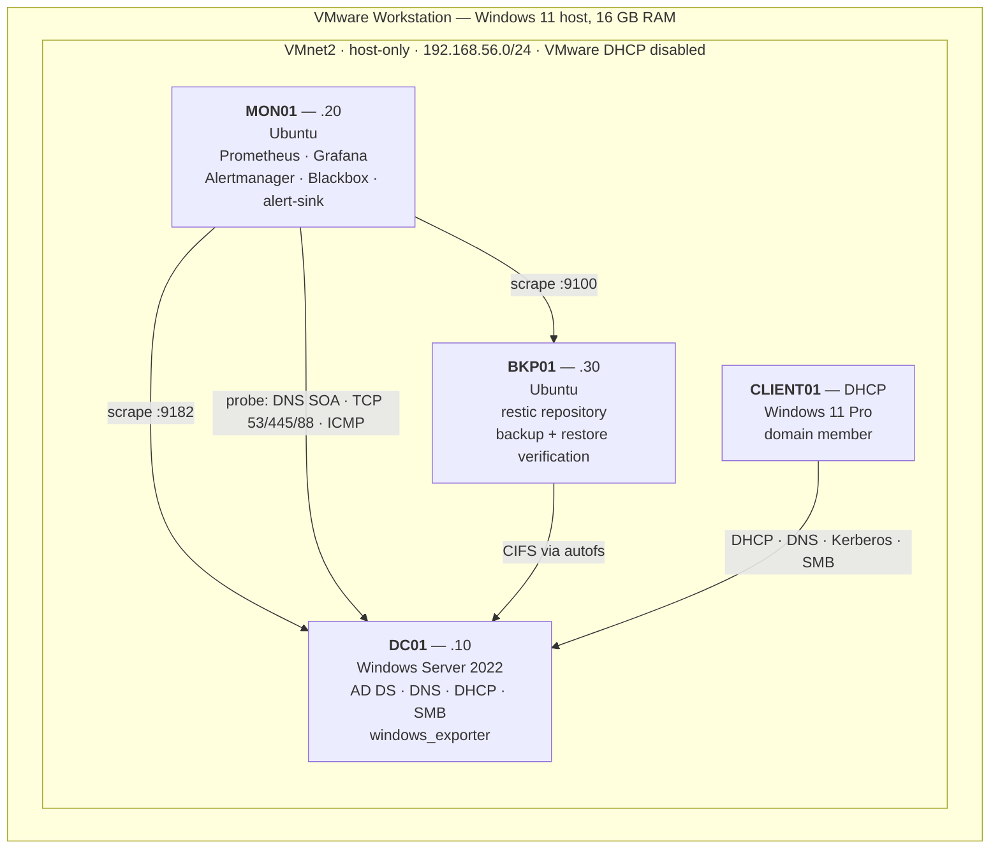
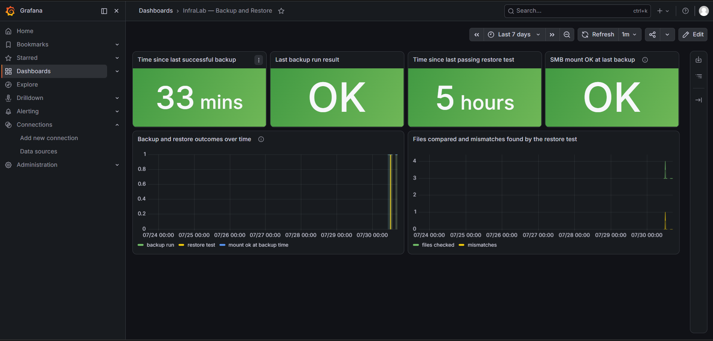

# InfraLab

**A mini datacenter, run like it matters.**

Four hosts on one laptop: an Active
Directory domain, full-stack monitoring with tested alert rules, encrypted
backups that are **restored and checksum-verified on a schedule** rather than
assumed to work, and five deliberately induced incidents — each detected,
investigated, resolved, and written up with its root cause.

Everything here was built by hand, broken on purpose, and documented honestly —
including the one incident that ends without a confirmed root cause, and every
place where this lab knowingly falls short of production.

**Stack:** Windows Server 2022 · Ubuntu · Active Directory · DNS · DHCP · SMB ·
Prometheus · Grafana · Alertmanager · Blackbox Exporter · restic · systemd ·
PowerShell · Bash

---

## Architecture



| Role | Host | Purpose |
|---|---|---|
| Domain Controller | DC01 | Identity, name resolution, address assignment, file services |
| Monitoring | MON01 | Metrics, dashboards, alerting, probes, scheduled health checks |
| Backup | BKP01 | Encrypted, deduplicated, automated off-host backup with verified restore |
| Workstation | CLIENT01 | Validates the domain from an end user's perspective |

VMware's own DHCP is disabled on the lab network — the first configuration
decision made, before any VM existed. Two DHCP servers on one segment produce
intermittent wrong-scope leases that present as random network flakiness rather
than as the configuration error they are.

Full topology, IP plan, domain design and the reasoning behind each:
[`docs/architecture.md`](docs/architecture.md)

---

## What makes this more than a homelab

**1. The backups are proven, not presumed.** A weekly job restores the latest
snapshot and SHA-256-compares **every file** against the source. Backup success
and restore success are separate Prometheus metrics with separate alerts,
because a backup can complete cleanly and still be unrestorable — and that is
precisely the failure a single "backups OK" indicator hides.

**2. The alert rules are unit-tested.** All 16 rules are covered by `promtool`
tests that run against synthetic time series — each rule proven to fire at its
threshold, and to stay silent below it, before ever being deployed. The tests
were watched failing against an empty rules file first.

**3. Failure publishes data instead of deleting it.** The backup job writes its
metrics from an `EXIT` trap, so a failed run still reports — with the previous
success timestamp intact from a separate state file. A naive script that stops
writing on failure makes its series go stale, and an alert comparing against a
vanished series never fires. The monitoring is designed to survive the failure
of the thing it monitors.

**4. Five incidents were induced, detected, and documented** — with real
command output, dead ends included, and one honest "not conclusively resolved."

**5. The gap between this lab and production is documented, not hidden.** A
risk register lists every known shortfall with its likelihood, the mitigation
actually in place, and what production would do instead.

---

## Incident response

Each incident followed the full lifecycle: failure → detection → investigation
→ root cause → fix → verification → prevention. Full records with timelines and
command output are in [`docs/incidents/`](docs/incidents/).

| ID | Incident | The finding worth keeping |
|---|---|---|
| [INC-001](docs/incidents/INC-001-dns-outage.md) | DNS service stopped on DC01 | The outage was **masked**: ping worked and short names still resolved via NetBIOS/LLMNR fallback while every FQDN lookup failed. Testing by IP, short name and FQDN separately is what isolated the fault — any single test would have given the wrong answer. |
| [INC-002](docs/incidents/INC-002-disk-capacity.md) | Disk capacity exhausted | Filled a dedicated volume, never the system disk — a full `C:` on a domain controller can corrupt the AD database. `WindowsDiskSpaceLow` fired as designed at 85%. |
| [INC-003](docs/incidents/INC-003-stale-backup.md) | Backup source unreachable | The planned test (`umount`) turned out to be **impossible on this host** — autofs remounts on the next access. DC01 was powered off instead, producing a genuine failure; the mount guard refused to back up an empty path, and recovery needed zero manual intervention. |
| [INC-004](docs/incidents/INC-004-kerberos-time-skew.md) | Kerberos clock skew | Skewed the **client's** clock, never the PDC Emulator's. Kerberos then tolerated ~19 minutes against a confirmed 5-minute policy — investigated, candidate explanations ruled out or listed, **root cause honestly recorded as unresolved** rather than forced into a tidy conclusion. |
| [INC-005](docs/incidents/INC-005-restore-mismatch.md) | Restore verification failure | Drove `RestoreTestFailed` end to end through Alertmanager without ever touching the restic repository. Also surfaced a real limitation: the checker cannot distinguish post-backup edits from corruption — known, documented, and acceptable only because this dataset is static. |

The deepest dive, INC-001, is worth reading in full:

| Test | Result | Conclusion |
|---|---|---|
| `ping 192.168.56.10` | 4/4 replies | Host and network are up |
| `nslookup dc01.lab.local` | Timed out | Name resolution is the failing layer |
| `dir \\192.168.56.10\CompanyShare` | Succeeded | SMB itself is healthy |
| `dir \\dc01\CompanyShare` | **Succeeded** | Short name resolved *without* DNS |
| `dir \\dc01.lab.local\CompanyShare` | Failed | FQDN requires DNS — fault isolated |

Prevention wasn't just restarting the service: DNS got restart-on-failure
recovery actions, a blackbox probe now asks the server a real SOA question
instead of checking that port 53 is open, and the daily health check verifies
the recovery configuration is still in place — because a setting nobody
verifies is a setting that quietly gets lost.

---

## Monitoring and alerting

| Layer | What | How |
|---|---|---|
| Host metrics | CPU, memory, disk, network on all three servers | node_exporter, windows_exporter |
| Windows services | NTDS, DNS, DHCPServer, Netlogon | windows_exporter service collector, alert at 2m down |
| Service reality | Does DNS actually *answer* for the zone? | Blackbox DNS SOA probe — a TCP check on port 53 proves only that something is listening, which was exactly the trap in INC-001 |
| Backup health | Exit code, last success age, snapshot count, mount state | Custom metrics via node_exporter textfile collector |
| Restore health | Last verification result, files compared, mismatches | Separate metrics, separate alerts |
| Delivery | Every notification logged with its firing time | `alert-sink`, a stdlib-only webhook receiver — the record an incident writeup needs, which Alertmanager's UI doesn't keep |

Thresholds are chosen, not defaulted — and each one's reasoning is written
down. `BackupStale` fires at **25 hours, not 24**: a daily job needs slack for
runtime variance, or it pages every time it runs a few minutes late, and an
alert that fires predictably is an alert people learn to ignore. A `NodeDown`
alert inhibits every other alert for the same host, so the notification is the
cause, not its six consequences.

Full rationale for every threshold: [`docs/monitoring-policy.md`](docs/monitoring-policy.md)

---

## Backup and verified restore

```
\\DC01\CompanyShare  ──CIFS via autofs──►  BKP01:/mnt/dc01-share
                                                │  restic backup --tag dc01-share
                                                ▼
                                    /var/backups/restic-repo
                                    encrypted · deduplicated · 7d/4w/6m retention
```

- **Pull, not push.** BKP01 holds the credential and reaches into DC01; DC01
  has no credential for the repository and no path to write into it. Ransomware
  on the file server reaches the source but never the snapshots.
- **Mount guard.** An unmounted CIFS mountpoint is just an empty directory, and
  backing it up yields a valid, empty snapshot that satisfies every freshness
  check while protecting nothing. The job refuses to run instead — proven in
  INC-003 against a genuinely unreachable DC01.
- **Rolling integrity checks.** `restic check --read-data-subset=N/7` after
  every backup: full pack-data verification once per week at a seventh of the
  daily cost.
- **systemd timers with `Persistent=true`**, migrated from cron for a
  documented reason: cron silently skips runs missed while the host is off, and
  BKP01 is powered down whenever CLIENT01 runs to stay inside the RAM budget.
  A missed window now executes at next boot instead of becoming a day without
  a backup.
- **Credentials** live in root-owned mode-600 files referenced by path — never
  in job definitions, script bodies, or `ps` output.

The full disaster-recovery loop was proven end to end: file deleted from the
live share, restored from a snapshot, contents verified, copied back, confirmed
on DC01. Then automated, so it keeps happening after everyone stops thinking
about it. Policy and design: [`docs/backup-policy.md`](docs/backup-policy.md)

---

## Security decisions

**The share ACL was rebuilt from the default.** `CompanyShare` shipped with
`Everyone: Full Control`. That became `LAB\IT-Team` only — on **both** layers,
because effective SMB access is the intersection of share and NTFS permissions.
The subtle part: NTFS inheritance from `C:\` had to be severed, because the
parent volume propagates `Users: Read & Execute`, which would have silently
re-granted read access to every domain user while the share ACL looked
perfectly locked down.

Verification surfaced a genuinely instructive failure: after the change, reads
worked from CLIENT01 but writes returned *Access Denied*. `whoami /groups`
showed no domain groups — the session token predated the `IT-Team` group, and
**group membership is stamped into the token at logon, not refreshed live**.
Sign out, sign in, working. Reads had kept working only because the SMB session
was already established; the new write forced a fresh authorisation check. The
symptom said "permissions are wrong" when the permissions were exactly right.

Elsewhere: the metrics endpoint on DC01 is firewalled to the collector's
address only (a metrics endpoint is a detailed host inventory); blackbox and
alert-sink bind to loopback (an exposed blackbox exporter is a ready-made SSRF
proxy — `/probe?target=` connects to whatever it's told); the lab segment has
no route to the internet; and the daily health check fails loudly if `Everyone`
ever reappears on the share ACL.

---

## Operations documentation

Written so that someone who is not me could run this lab.

| | |
|---|---|
| [`docs/architecture.md`](docs/architecture.md) | Topology, network and domain design, resource budget, the reasoning |
| [`docs/inventory.md`](docs/inventory.md) | Hosts, services, accounts, scheduled jobs, versions |
| [`docs/monitoring-policy.md`](docs/monitoring-policy.md) | Every threshold and why it's that number; known gaps stated plainly |
| [`docs/backup-policy.md`](docs/backup-policy.md) | Scope, retention, verification, why a snapshot is not a backup |
| [`docs/risks.md`](docs/risks.md) | Risk register: accepted risks, mitigations in place, risks closed |
| [`docs/incidents/`](docs/incidents/) | Five full root-cause records plus the template they follow |
| [`docs/changes/`](docs/changes/) | CHANGE-001 → 005: reason, risk, rollback, verification, outcome |
| [`docs/runbooks/`](docs/runbooks/) | Six procedures: restores, DNS failure, disk full, DC recovery, onboarding a host |

The change records read as a build history, not snapshots — each one names the
gaps it left open and which later change closed them. CHANGE-002 deployed
dashboards but no alerting; INC-001 then proved exactly why that mattered;
CHANGE-005 closed it.

---

## Verification

Nothing here is claimed without a check that could have failed:

| What | How it's proven |
|---|---|
| 16 alert rules | `promtool check rules` + unit tests against synthetic series, watched failing first |
| Backup scripts | shellcheck clean; mount guard tested against a real unreachable source |
| Restore path | Weekly full-tree SHA-256 comparison; negative-tested by corrupting a disposable restored copy |
| Windows health check | `-SelfTest` asserts the rendering logic, including HTML encoding of log-derived text; verified to fail when the encoding is removed |
| Alert delivery | Every firing recorded in the alert-sink log with timestamps |
| Repository hygiene | No credential has ever been committed — verified across the full git history, not just the working tree |

---

## Evidence

Eighteen screenshots of the running lab, indexed in
[`screenshots/README.md`](screenshots/README.md) — the DHCP configuration that
everything depended on, the domain working from a user's perspective, every
Prometheus target up, backups and restores passing, and the alert-sink log
capturing three incidents firing and resolving live with the timestamps the
incident records cite.



*The backup dashboard: time since last successful backup, last run result,
time since last passing restore test, and mount state — backup and restore
tracked as separate signals, because a backup can succeed while its restore
fails.*

---

## Known limitations

Stated deliberately — this is a learning lab, and pretending otherwise would
be the fastest way to discredit everything above.

- **Single domain controller.** DC01 failing takes identity, DNS and DHCP with
  it. Production runs at least two, in separate failure domains.
- **Backups break 3-2-1 outright.** One physical laptop holds source and
  repository. Production requires off-device and off-site copies, one immutable.
- **The domain uses `.local`** — reserved for mDNS; `.test` was correct. Caught
  after promotion, when fixing it meant rebuilding the forest. Accepted and
  documented: the clearest lesson here in decisions that are free before
  deployment and expensive after.
- **The AD database is not backed up** — only the file share is. VM snapshots
  cover DC01, and a snapshot is not a backup (the policy doc explains why).
- **The clock-skew alert is a proxy.** This windows_exporter build exposes NTP
  round-trip delay, not true offset — documented as an imperfect signal, not
  passed off as solving the problem INC-004 exposed.
- **Lab-grade passwords**, no PKI, no centralised logging, health-check log not
  yet exported to Prometheus — the natural next additions.

Full register with likelihoods and production remedies: [`docs/risks.md`](docs/risks.md)

---

## Skills demonstrated

| Area | Evidence |
|---|---|
| Active Directory | Forest deployment, OU design, security groups, domain join, token behaviour |
| Windows Server | DNS, DHCP, SMB, service recovery, scheduled tasks, event log analysis |
| Access control | Share + NTFS intersection, inheritance traps, least privilege, verification from the client side |
| Linux administration | systemd services and timers, autofs, CIFS, credential file hygiene |
| Monitoring | Prometheus, Grafana, three exporter types, blackbox probing, custom metrics |
| Alerting engineering | Unit-tested rules, reasoned thresholds, inhibition, failure-surviving metric design |
| Backup & DR | Encrypted deduplicated backups, pull architecture, automated verified restore |
| Incident response | Five full RCA cycles; layered fault isolation; honest handling of an unresolved finding |
| Change management | Five change records with risk, rollback and verification |
| Documentation | Policies, runbooks, risk register — written for the next operator, not for show |

---

*Built as an independent learning project. Not affiliated with, endorsed by, or
produced by any company or organization. Credentials and repository passwords
are stored locally and have never been committed to source control.*
