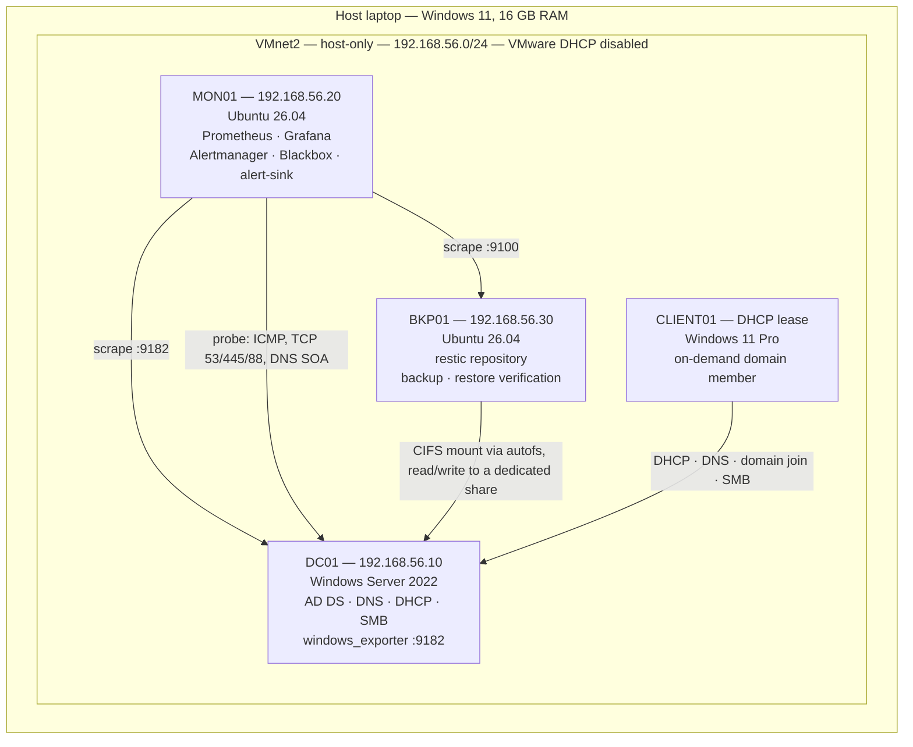

# Architecture

## Overview

A four-host lab on a single laptop, built to exercise the same operational
concerns as a small production site: a directory service, a monitored estate, a
backup that is proven by restore rather than assumed to work, and documentation
good enough for someone else to operate from.

## Topology



## Network design

Single custom host-only network, `VMnet2`, subnet `192.168.56.0/24`.

**VMware's own DHCP service is disabled on this network.** DC01 holds the DHCP
role, and two DHCP servers on one segment produce intermittent, misleading
failures — clients receive addresses from whichever server answers first, so the
symptom looks like random connectivity loss rather than a configuration error.
This was the first configuration decision made in the lab, before any VM was
built, for exactly that reason.

### IP plan

| Address | Host | Assignment | Notes |
|---|---|---|---|
| 192.168.56.10 | DC01 | Static | Domain controller, DNS server for the segment |
| 192.168.56.20 | MON01 | Static | Prometheus :9090, Grafana :3000, Alertmanager :9093 |
| 192.168.56.30 | BKP01 | Static | node_exporter :9100 |
| 192.168.56.101 | CLIENT01 | DHCP, from DC01's scope | On-demand only |

### Internet access

Host-only networks have no route off the host. Each VM had a second adapter on
VMware NAT for OS updates and package installation, disconnected afterward so
lab traffic stays on VMnet2. This also makes monitoring a fair test: nothing
reaches the internet to mask a broken internal dependency.

## Domain design

| Setting | Value |
|---|---|
| DNS domain | `lab.local` |
| NetBIOS name | `LAB` |

`.local` is reserved for multicast DNS (Avahi/Bonjour on the Linux hosts), and a
name under `.test` would have been the technically correct choice. This was
identified after promotion, when renaming would have meant rebuilding the
forest, and was accepted rather than corrected. Full reasoning is in
[`docs/risks.md`](risks.md).

### Directory structure

```
lab.local
└── Company
    ├── Computers   → CLIENT01
    ├── Employees   → ali
    └── Groups      → IT-Team
```

### Accounts

| Account | Purpose | Privilege |
|---|---|---|
| `LAB\Administrator` | Domain administration | Domain Admin, interactive use only |
| `LAB\ali` | Ordinary user, used from CLIENT01 | Domain Users |
| `LAB\IT-Team` | Sole principal on `CompanyShare`'s share and NTFS ACLs | See [`docs/backup-policy.md`](backup-policy.md) |

`CompanyShare` was originally created with the Windows default of
`Everyone: Full Control`; that was replaced with `IT-Team`-only access on both
the share and NTFS layers, and inheritance from `C:\` was disabled — the parent
volume was re-granting `Users: Read & Execute` and would have silently defeated
the restriction. Full detail in
[`docs/changes/CHANGE-004-share-acl-lockdown.md`](changes/CHANGE-004-share-acl-lockdown.md).

## Resource budget

| State | DC01 | MON01 | BKP01 | CLIENT01 | Total |
|---|---|---|---|---|---|
| Steady | 4 GB | 3 GB | 1.5 GB | off | 8.5 GB |
| Client demo | 4 GB | 3 GB | **off** | 2 GB | 9 GB |

16 GB total. BKP01 is shut down while CLIENT01 runs — the RAM does not allow all
four at once. Backups are not lost during that window: the scheduled jobs run
as systemd timers with `Persistent=true`, so a run missed while BKP01 was off
executes at next boot instead of being skipped.

## Monitoring path

```
                    ┌─────────────────────────────┐
                    │           MON01              │
                    │                               │
  DC01 ────scrape──►│  Prometheus ──► Alertmanager │──► alert-sink (log)
  BKP01 ───scrape──►│       ▲              │        │
                    │       │              ▼        │
                    │   blackbox ──►    Grafana      │
                    │  (DNS/TCP/ICMP)                │
                    └─────────────────────────────┘
```

Prometheus scrapes node_exporter on MON01 and BKP01, windows_exporter on DC01,
and drives blackbox probes against DC01's DNS, SMB and Kerberos ports plus a DNS
SOA query. Alertmanager routes firing alerts to `alert-sink`, a small
loopback-bound webhook receiver that logs every notification with its firing
time — the record an incident writeup actually needs, which Alertmanager's own
UI does not keep.

Full detail: [`docs/monitoring-policy.md`](monitoring-policy.md).

## Backup path

```
\\DC01\CompanyShare
        │  CIFS mount via autofs (not a static fstab entry)
        ▼
BKP01: /mnt/dc01-share
        │  restic backup --tag dc01-share
        ▼
BKP01: /var/backups/restic-repo
```

Pulled, not pushed: BKP01 holds the credential and reaches into DC01, which has
none for the repository and no route to write into it. A guard refuses to back
up an unmounted or empty share, and a weekly job restores the latest snapshot
and checksum-compares the entire tree against the live source — a backup that
has never been restored is a hope, not a backup.

Full detail: [`docs/backup-policy.md`](backup-policy.md).

## Software versions

| Component | Version |
|---|---|
| Windows Server | 2022 Standard, evaluation edition |
| Ubuntu Server | 26.04 |
| Windows client | 11 Pro |
| Prometheus | 3.13.1 |
| Grafana | 13.1.1 |
| restic | 0.18.1 |

Windows Server is an evaluation edition and expires 180 days from installation
— recorded in [`docs/risks.md`](risks.md) rather than left to be discovered.

## What this diagram does not show

A single domain controller, a single monitoring host, and a backup repository
on the same physical laptop as its source are all real, accepted constraints of
a one-machine lab, not oversights. Each is in the risk register with its
production remedy stated. See [`docs/risks.md`](risks.md).
