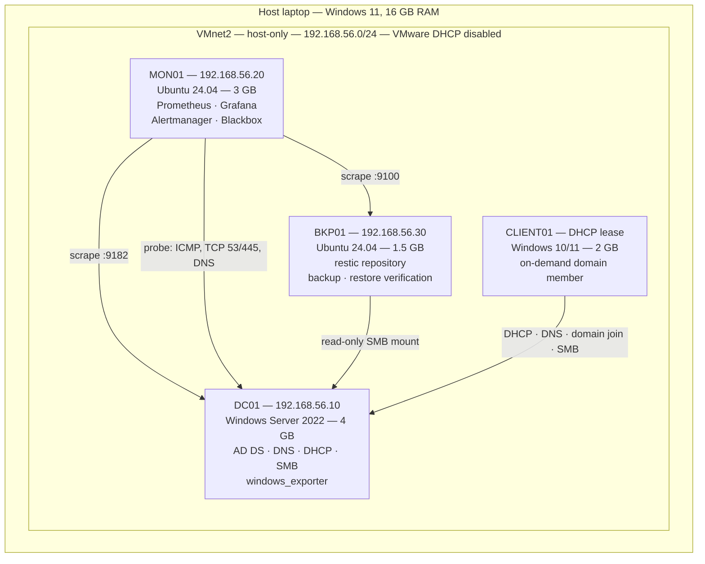

# Mini Datacenter Infrastructure Lab Implementation Plan

> **For agentic workers:** REQUIRED SUB-SKILL: Use superpowers:subagent-driven-development (recommended) or superpowers:executing-plans to implement this plan task-by-task. Steps use checkbox (`- [ ]`) syntax for tracking.

**Goal:** Build a documented home-lab datacenter — a Windows Server domain controller, a Prometheus/Grafana monitoring stack, and restic backups with verified restore testing — and publish it as a portfolio repository that evidences junior infrastructure engineering competency.

**Architecture:** Four VMs on VMware Workstation sharing one host-only network. DC01 (Windows Server 2022) provides AD DS, DNS, DHCP and an SMB share. MON01 (Ubuntu) runs the monitoring stack from a single docker-compose file. BKP01 (Ubuntu) pulls the share over a read-only SMB mount into a local restic repository and publishes backup and restore-test outcomes to Prometheus through the node_exporter textfile collector. CLIENT01 (Windows 10/11) starts on demand to prove DHCP, domain join and Group Policy actually work.

**Tech Stack:** VMware Workstation Pro, Windows Server 2022, Ubuntu 24.04 LTS, Docker Compose, Prometheus, Grafana, Alertmanager, Blackbox exporter, node_exporter, windows_exporter, restic, systemd timers, PowerShell 5.1, Bash.

---

## Task Types

Every task is labelled. Read the label before starting — it determines who does the work.

| Label | Meaning |
|---|---|
| **[REPO]** | Produces committable files only. An agent can complete this without the lab existing. |
| **[MANUAL]** | Hands-on work at the VM console. Only the human operator can do this. The task lists exact steps and what to capture. |
| **[MIXED]** | Repo files written first, then deployed and verified by hand. |

**Incident writeups (Task 12) are deliberately left unwritten by this plan.** They must record what actually happened during the induced failure — the real alert timing, the real log lines, the real recovery. Inventing them would hollow out the one section that most distinguishes this project. The plan supplies the template and the method, not the content.

---

## Global Constraints

Every task's requirements implicitly include this section. Values are copied verbatim from the spec.

- **Repository name:** `mini-datacenter-infrastructure-lab`
- **DNS domain:** `corp.infralab.test` — `.test` is RFC 6761 reserved. Never use `.local` (claimed by mDNS/Avahi, breaks resolution on the Ubuntu hosts).
- **NetBIOS name:** `INFRALAB`
- **Network:** host-only `VMnet2`, `192.168.56.0/24`, **VMware's own DHCP disabled on this network**
- **Static addresses:** DC01 `192.168.56.10`, MON01 `192.168.56.20`, BKP01 `192.168.56.30`
- **DHCP scope (DC01 only):** `192.168.56.100` – `192.168.56.150`
- **Custom metric prefix:** `infralab_` — every custom metric name starts with it
- **Config directory on Linux hosts:** `/etc/infralab/`
- **State directory on Linux hosts:** `/var/lib/infralab/`
- **Textfile collector directory:** `/var/lib/prometheus/node-exporter/`
- **Accounts:** `INFRALAB\Administrator` (interactive admin only), `INFRALAB\svc-backup` (read-only on the share, no admin rights, no interactive logon), `INFRALAB\ali` (Domain Users)
- **RAM rule:** steady state is DC01 4 GB + MON01 3 GB + BKP01 1.5 GB = 8.5 GB. CLIENT01 (2 GB) runs on demand only, and **BKP01 is shut down while CLIENT01 runs**.
- **Backup retention:** `--keep-daily 7 --keep-weekly 4 --keep-monthly 6`
- **BackupStale threshold:** 26 hours (not 24 — a daily job needs slack for runtime variance and clock drift)
- **PowerShell target:** 5.1 (Windows Server 2022 default). **No ternary `?:`, no `??`, no `-AsHashtable`** — those are PowerShell 7 only.
- **Disclaimer, verbatim in README:** "This is an independent personal learning project created to demonstrate infrastructure engineering skills. It is not affiliated with, endorsed by, or produced by any company or organization. No real company systems, data, branding, or logos are used."
- **Secrets:** no real credential ever reaches a committed file. Commit `.env.example` and `config.example` with placeholders only.
- **Commits:** no `Co-Authored-By` trailer, no AI attribution.

---

## File Structure

Files are created when their task produces them. Empty placeholder scaffolding is not created up front.

| File | Responsibility | Task |
|---|---|---|
| `README.md` | Disclaimer, project summary, architecture diagram, phase status, screenshot index | 1, 13 |
| `LICENSE` | MIT | 1 |
| `.gitignore` | Keep every secret and data volume out of version control | 1 |
| `.env.example` | Grafana credentials template consumed by docker-compose | 1 |
| `docs/architecture.md` | Topology, network design, IP plan, domain design, and the reasoning behind each | 2 |
| `docs/inventory.md` | Asset table — the operational register of what exists | 3 |
| `docs/monitoring-policy.md` | What is monitored, thresholds and why, alert routing | 6 |
| `docs/backup-policy.md` | Scope, schedule, retention, verification, snapshot-vs-backup, lab simplifications | 9 |
| `docs/risks.md` | Risk register — where the lab honestly diverges from production | 12 |
| `docs/changes/CHANGE-NNN-*.md` | One record per structural change | 3, 6, 9 |
| `docs/incidents/INC-NNN-*.md` | One root-cause analysis per induced failure | 12 |
| `docs/runbooks/*.md` | Procedures a colleague could follow without asking you | 10, 12 |
| `docs/vmware-hol/*.md` | vSphere Hands-on Labs notes covering the real-ESXi gap | 13 |
| `monitoring/docker-compose.yml` | The entire monitoring stack in one file | 5 |
| `monitoring/prometheus/prometheus.yml` | Scrape configuration | 5 |
| `monitoring/prometheus/alerts.yml` | Alert rules | 8 |
| `monitoring/prometheus/alerts_test.yml` | promtool unit tests for the alert rules | 8 |
| `monitoring/alertmanager/alertmanager.yml` | Routing, grouping, inhibition | 5 |
| `monitoring/alertmanager/alert-sink.conf` | nginx config for the local webhook receiver | 5 |
| `monitoring/blackbox/blackbox.yml` | Probe module definitions | 5 |
| `monitoring/grafana/provisioning/**` | Datasource and dashboard providers | 5 |
| `monitoring/grafana/dashboards/*.json` | Dashboards as code | 5 |
| `scripts/linux/config.example` | Non-secret configuration shared by all three Linux scripts | 9 |
| `scripts/linux/backup.sh` | Guarded restic backup + retention + integrity check + metrics | 9 |
| `scripts/linux/check-smb.sh` | Real SMB read test, closes the gap blackbox cannot cover | 9 |
| `scripts/linux/verify-restore.sh` | Restore, checksum the whole tree, compare, publish metrics | 10 |
| `scripts/linux/systemd/*.service`, `*.timer` | Scheduling for the three Linux scripts | 9, 10 |
| `scripts/windows/Invoke-HealthCheck.ps1` | Daily DC health check producing an HTML report | 11 |
| `scripts/windows/Install-HealthCheckTask.ps1` | Registers the scheduled task | 11 |
| `sample-reports/health-check-sample.html` | Committed sample output so the repo shows results without the lab running | 11 |

---

## Task 1: Repository skeleton — [REPO]

**Files:**
- Create: `README.md`
- Create: `LICENSE`
- Create: `.gitignore`
- Create: `.env.example`

**Interfaces:**
- Consumes: nothing.
- Produces: `.env.example` defines `GF_SECURITY_ADMIN_USER` and `GF_SECURITY_ADMIN_PASSWORD`, consumed by `monitoring/docker-compose.yml` in Task 5 via `env_file: ../.env`.

- [ ] **Step 1: Write `.gitignore`**

```gitignore
# Secrets — never commit real credentials
.env
*.password
*.secret
*.cred
credentials/
restic-password.txt

# Runtime data volumes
monitoring/grafana-data/
monitoring/prometheus-data/
monitoring/alertmanager-data/

# Generated health check reports (a curated sample lives in sample-reports/)
HealthChecks/
*.local.html

# OS noise
Thumbs.db
desktop.ini
.DS_Store
```

- [ ] **Step 2: Write `.env.example`**

```bash
# Copy to .env in the repository root before starting the monitoring stack.
# .env is gitignored. Never commit real values.

# Interface the monitoring stack publishes its ports on. This is MON01's lab
# address, NOT 0.0.0.0. Prometheus and Alertmanager have no authentication and
# both expose state-changing endpoints, so they must not be reachable from the
# temporary NAT adapter. The address must already exist on the host or Docker
# will refuse to bind — which is the correct way to notice it is missing.
LAB_BIND=192.168.56.20

# Grafana initial administrator account.
GF_SECURITY_ADMIN_USER=admin
GF_SECURITY_ADMIN_PASSWORD=change-me-before-first-start

# Disable Grafana's anonymous usage reporting in an offline lab.
GF_ANALYTICS_REPORTING_ENABLED=false
GF_ANALYTICS_CHECK_FOR_UPDATES=false
```

- [ ] **Step 3: Write `LICENSE`**

```
MIT License

Copyright (c) 2026 Ali

Permission is hereby granted, free of charge, to any person obtaining a copy
of this software and associated documentation files (the "Software"), to deal
in the Software without restriction, including without limitation the rights
to use, copy, modify, merge, publish, distribute, sublicense, and/or sell
copies of the Software, and to permit persons to whom the Software is
furnished to do so, subject to the following conditions:

The above copyright notice and this permission notice shall be included in all
copies or substantial portions of the Software.

THE SOFTWARE IS PROVIDED "AS IS", WITHOUT WARRANTY OF ANY KIND, EXPRESS OR
IMPLIED, INCLUDING BUT NOT LIMITED TO THE WARRANTIES OF MERCHANTABILITY,
FITNESS FOR A PARTICULAR PURPOSE AND NONINFRINGEMENT. IN NO EVENT SHALL THE
AUTHORS OR COPYRIGHT HOLDERS BE LIABLE FOR ANY CLAIM, DAMAGES OR OTHER
LIABILITY, WHETHER IN AN ACTION OF CONTRACT, TORT OR OTHERWISE, ARISING FROM,
OUT OF OR IN CONNECTION WITH THE SOFTWARE OR THE USE OR OTHER DEALINGS IN THE
SOFTWARE.
```

- [ ] **Step 4: Write the initial `README.md`**

The phase table is updated at the end of every subsequent task. Task 13 rewrites this file into its final form.

````markdown
# Mini Datacenter Infrastructure Lab

> This is an independent personal learning project created to demonstrate infrastructure engineering skills. It is not affiliated with, endorsed by, or produced by any company or organization. No real company systems, data, branding, or logos are used.

A small, fully documented datacenter built on a laptop: a Windows Server domain,
a Prometheus and Grafana monitoring stack, and restic backups that are restored
and checksum-verified on a schedule rather than assumed to work.

The lab runs on VMware Workstation. This repository is the part that travels —
the automation, the configuration, the operational documentation, and the
incident record.

## What is in here

| Area | Where |
|---|---|
| Architecture, network and domain design | `docs/architecture.md` |
| Asset inventory | `docs/inventory.md` |
| Monitoring and alerting policy | `docs/monitoring-policy.md` |
| Backup and restore policy | `docs/backup-policy.md` |
| Risk register | `docs/risks.md` |
| Change records | `docs/changes/` |
| Incident root-cause analyses | `docs/incidents/` |
| Runbooks | `docs/runbooks/` |
| Monitoring stack as code | `monitoring/` |
| Backup and verification scripts | `scripts/linux/` |
| Windows health check | `scripts/windows/` |

## Environment

| Host | OS | RAM | IP | Role |
|---|---|---|---|---|
| DC01 | Windows Server 2022 | 4 GB | 192.168.56.10 | AD DS, DNS, DHCP, SMB share |
| MON01 | Ubuntu 24.04 | 3 GB | 192.168.56.20 | Prometheus, Grafana, Alertmanager, Blackbox |
| BKP01 | Ubuntu 24.04 | 1.5 GB | 192.168.56.30 | restic repository, backup and restore verification |
| CLIENT01 | Windows 10/11 | 2 GB | DHCP | Domain member, started on demand |

Domain: `corp.infralab.test` (NetBIOS `INFRALAB`). Host-only network `VMnet2`,
`192.168.56.0/24`, with VMware's own DHCP disabled so DC01 is the only DHCP
server on the segment.

## Build status

| Phase | Deliverable | Status |
|---|---|---|
| 0 | Repository skeleton, network, ISOs | in progress |
| 1 | DC01 — AD DS, DNS, DHCP, SMB share | not started |
| 2 | CLIENT01 — domain join verification | not started |
| 3 | MON01 — monitoring stack | not started |
| 4 | BKP01 — backups | not started |
| 5 | Restore verification | not started |
| 6 | Windows health checks | not started |
| 7 | Incident simulations | not started |
| 8 | VMware Hands-on Labs | not started |
| 9 | Final documentation pass | not started |

## Credentials

Credentials and repository passwords are stored locally and are not committed
to source control. `.env.example` and `scripts/linux/config.example` show the
required shape with placeholder values.
````

- [ ] **Step 5: Verify no secret patterns are present**

Run from the repository root:

```powershell
Select-String -Path .\.env.example, .\.gitignore, .\README.md -Pattern "password\s*=\s*(?!change-me)\S+" -CaseSensitive:$false
```

Expected: no output. The only assignment containing the word `password` is the placeholder `change-me-before-first-start`.

- [ ] **Step 6: Commit**

```bash
git add README.md LICENSE .gitignore .env.example
git commit -m "Add repository skeleton, licence and secret exclusions"
```

---

## Task 2: Lab network and installation media — [MANUAL]

**Files:**
- Create: `docs/architecture.md`

**Interfaces:**
- Consumes: nothing.
- Produces: the `VMnet2` network every later VM attaches to, and the IP plan every configuration file references.

- [ ] **Step 1: Install VMware Workstation Pro**

Download from Broadcom's site and install. It is free for personal use — record the version used in `docs/architecture.md`.

- [ ] **Step 2: Create the host-only network and disable its DHCP**

`Edit → Virtual Network Editor → Change Settings` (elevates), then:

1. `Add Network…` → select `VMnet2`
2. Type: **Host-only**
3. Subnet IP: `192.168.56.0`, Subnet mask: `255.255.255.0`
4. **Uncheck "Use local DHCP service to distribute IP addresses to VMs"**
5. Leave "Connect a host virtual adapter to this network" checked — the host needs an interface on the segment to reach Grafana.
6. Apply, OK.

Step 4 is the critical one. Leaving VMware's DHCP enabled puts a second DHCP server on the same segment as DC01's DHCP role. The failure is intermittent: whichever server answers a `DHCPDISCOVER` first wins, so clients get addresses from the wrong scope some of the time and the symptom looks like random network flakiness rather than a configuration error.

- [ ] **Step 3: Verify the host adapter and confirm no DHCP is answering**

```powershell
Get-NetIPAddress -AddressFamily IPv4 | Where-Object { $_.IPAddress -like '192.168.56.*' } |
    Select-Object InterfaceAlias, IPAddress
```

Expected: one `VMware Network Adapter VMnet2` entry with an address in `192.168.56.0/24`.

Re-open the Virtual Network Editor and confirm the DHCP checkbox for VMnet2 is still clear. Screenshot this — it is the evidence for `docs/architecture.md`.

- [ ] **Step 4: Download installation media**

| Media | Source | Note |
|---|---|---|
| Windows Server 2022 evaluation ISO | Microsoft Evaluation Center | 180-day evaluation, appropriate for a lab. Record that it is an evaluation edition. |
| Ubuntu Server 24.04 LTS ISO | ubuntu.com | Used for both MON01 and BKP01 |
| Windows 10 or 11 ISO | Microsoft | For CLIENT01, built in Task 4 |

Resolves the first open item in the spec. Note the exact build numbers in `docs/architecture.md`.

- [ ] **Step 5: Write `docs/architecture.md`**

````markdown
# Architecture

## Overview

A four-host lab on a single laptop, built to exercise the same operational
concerns as a small production site: a directory service, a monitored estate,
a backup that is proven by restore, and documentation good enough for someone
else to operate.

## Topology



## Network design

One custom host-only network, `VMnet2`, subnet `192.168.56.0/24`.

**VMware's own DHCP service is disabled on this network.** DC01 holds the DHCP
role, and two DHCP servers on one segment produce intermittent, misleading
failures — clients receive addresses from whichever server replies first, so
the symptom presents as random connectivity loss rather than a configuration
error.

### IP plan

| Address | Host | Assignment | Notes |
|---|---|---|---|
| 192.168.56.1 | Host adapter | Static (VMware) | Lets the host browser reach Grafana |
| 192.168.56.10 | DC01 | Static | DNS server for the whole segment |
| 192.168.56.20 | MON01 | Static | Grafana :3000, Prometheus :9090, Alertmanager :9093 |
| 192.168.56.30 | BKP01 | Static | node_exporter :9100 |
| 192.168.56.100–150 | DHCP pool | Dynamic, from DC01 | CLIENT01 and any future clients |
| 192.168.56.151–254 | Reserved | — | Room for future static assignments |

### Internet access

Host-only networks have no route off the host. Each VM has a second adapter on
VMware NAT used only for OS updates and package installation, **disconnected
afterwards** so that all lab traffic stays on VMnet2 and the segment behaves
predictably. This also makes the lab a fair test of the monitoring: nothing
reaches the internet to mask a broken internal dependency.

## Domain design

| Setting | Value |
|---|---|
| DNS domain | `corp.infralab.test` |
| NetBIOS name | `INFRALAB` |
| Functional level | Windows Server 2016 or higher |

`.test` is reserved by RFC 6761 for testing and cannot collide with a real
public domain. `.local` is deliberately avoided: it is claimed by mDNS
(Avahi, Bonjour), and on the Ubuntu hosts it produces resolution behaviour
that looks like a DNS fault but is not one.

### Accounts

| Account | Purpose | Privilege |
|---|---|---|
| `INFRALAB\Administrator` | Domain administration | Domain Admin, interactive use only |
| `INFRALAB\svc-backup` | BKP01 reads the SMB share | Read-only on the share, no admin rights, no interactive logon |
| `INFRALAB\ali` | Ordinary user, used from CLIENT01 | Domain Users |

The backup account is deliberately not a domain administrator. A backup job
needs to read one share; granting it more than that turns a backup credential
into a domain compromise if it leaks.

## Resource budget

| State | DC01 | MON01 | BKP01 | CLIENT01 | Total |
|---|---|---|---|---|---|
| Steady | 4 GB | 3 GB | 1.5 GB | off | 8.5 GB |
| Client demo | 4 GB | 3 GB | **off** | 2 GB | 9 GB |

16 GB total, so roughly 6 GB stays with the host. BKP01 is shut down while
CLIENT01 runs. Backups are not lost — the timer catches up on next boot
because the systemd timers use `Persistent=true`.

## Software versions

| Component | Version |
|---|---|
| VMware Workstation Pro | _record actual version_ |
| Windows Server | 2022 evaluation, build _record actual build_ |
| Ubuntu Server | 24.04 LTS |
| Windows client | _record actual edition and build_ |
````

Replace each `_record actual…_` with the real value as you install. They are the only placeholders permitted in this file, and they must be gone by Task 13.

- [ ] **Step 6: Verify the document renders**

Open `docs/architecture.md` on GitHub after pushing and confirm the Mermaid diagram renders as a diagram rather than a code block. GitHub renders ```mermaid fences natively.

- [ ] **Step 7: Commit**

```bash
git add docs/architecture.md
git commit -m "Document lab topology, IP plan and domain design"
```

---

## Task 3: DC01 — domain controller — [MANUAL]

**Files:**
- Create: `docs/inventory.md`
- Create: `docs/changes/CHANGE-001-create-domain.md`

**Interfaces:**
- Consumes: the `VMnet2` network from Task 2.
- Produces: domain `corp.infralab.test` at `192.168.56.10`; share `\\DC01\DepartmentData`; account `INFRALAB\svc-backup` used by Task 9; `windows_exporter` scrape target on `192.168.56.10:9182` used by Task 7.

- [ ] **Step 1: Create the VM**

| Setting | Value |
|---|---|
| Name | DC01 |
| Guest OS | Windows Server 2022 |
| Memory | 4096 MB |
| Processors | 2 |
| Disk 0 | 60 GB, split into multiple files |
| Network adapter 1 | Custom → VMnet2 |
| Network adapter 2 | NAT (temporary, for updates) |

Install Windows Server 2022 **with the Desktop Experience** — Server Core saves about 1.5 GB but you need the GUI for DHCP and Group Policy screenshots.

- [ ] **Step 2: Add the second disk that later hosts the disk-full incident**

Add a second 5 GB virtual disk. Inside Windows: `Disk Management` → initialize GPT → new simple volume → assign `D:` → label `LabData` → format NTFS.

This disk exists so INC-001 has somewhere safe to fill. **The system disk is never intentionally filled** — a full `C:` on a domain controller can corrupt the AD database and turn a scripted exercise into a real rebuild.

- [ ] **Step 3: Set the static address on the VMnet2 adapter**

Identify which adapter is on VMnet2 (it will have no gateway and no internet), then:

```powershell
$if = (Get-NetAdapter | Where-Object { $_.Status -eq 'Up' } | Out-GridView -PassThru).Name
New-NetIPAddress -InterfaceAlias $if -IPAddress 192.168.56.10 -PrefixLength 24
Set-DnsClientServerAddress -InterfaceAlias $if -ServerAddresses 127.0.0.1
```

No default gateway on this adapter. The NAT adapter provides the default route while it is connected.

Verify:

```powershell
Get-NetIPAddress -AddressFamily IPv4 | Select-Object InterfaceAlias, IPAddress, PrefixLength
```

Expected: `192.168.56.10/24` on the VMnet2 adapter.

- [ ] **Step 4: Rename the computer and reboot**

```powershell
Rename-Computer -NewName DC01 -Restart
```

Renaming after promotion is disruptive; do it first.

- [ ] **Step 5: Install AD DS and promote to a new forest**

```powershell
Install-WindowsFeature -Name AD-Domain-Services -IncludeManagementTools

Install-ADDSForest `
    -DomainName 'corp.infralab.test' `
    -DomainNetbiosName 'INFRALAB' `
    -ForestMode 'WinThreshold' `
    -DomainMode 'WinThreshold' `
    -InstallDns `
    -NoRebootOnCompletion:$false `
    -Force
```

`WinThreshold` is the Windows Server 2016 functional level. You are prompted for the Directory Services Restore Mode password — store it in your password manager, never in the repository.

The server reboots and comes up as a domain controller.

- [ ] **Step 6: Verify the domain is healthy**

```powershell
Get-ADDomain | Select-Object DNSRoot, NetBIOSName, DomainMode
Get-ADForest | Select-Object Name, ForestMode
dcdiag /test:DNS
Get-Service NTDS, DNS, Netlogon | Select-Object Name, Status
```

Expected: `DNSRoot` is `corp.infralab.test`, `NetBIOSName` is `INFRALAB`, `dcdiag` reports `passed test DNS`, and all three services are `Running`.

- [ ] **Step 7: Add a DNS forwarder so the segment can resolve external names**

```powershell
Set-DnsServerForwarder -IPAddress 8.8.8.8, 1.1.1.1 -PassThru
```

Verify:

```powershell
Resolve-DnsName ubuntu.com -Server 127.0.0.1
```

Expected: an answer. This only works while the NAT adapter is connected — that is correct and expected.

- [ ] **Step 8: Install and configure DHCP**

```powershell
Install-WindowsFeature -Name DHCP -IncludeManagementTools

Add-DhcpServerv4Scope `
    -Name 'InfraLab-VMnet2' `
    -StartRange 192.168.56.100 `
    -EndRange 192.168.56.150 `
    -SubnetMask 255.255.255.0 `
    -State Active

Set-DhcpServerv4OptionValue -ScopeId 192.168.56.0 -DnsServer 192.168.56.10 -DnsDomain 'corp.infralab.test'

Add-DhcpServerInDC -DnsName DC01.corp.infralab.test -IPAddress 192.168.56.10
Restart-Service DHCPServer
```

No router option is set — the lab segment has no gateway by design.

Verify:

```powershell
Get-DhcpServerv4Scope
Get-DhcpServerInDC
Get-Service DHCPServer | Select-Object Name, Status
```

Expected: the scope is listed and `Active`, the server appears as authorised in AD, and the service is `Running`.

- [ ] **Step 9: Create the accounts**

```powershell
# Ordinary user, used from CLIENT01 in Task 4.
New-ADUser -Name 'ali' -SamAccountName 'ali' `
    -UserPrincipalName 'ali@corp.infralab.test' `
    -AccountPassword (Read-Host -AsSecureString 'Password for ali') `
    -Enabled $true -ChangePasswordAtLogon $false

# Backup service account. Read-only on one share, nothing more.
New-ADUser -Name 'svc-backup' -SamAccountName 'svc-backup' `
    -UserPrincipalName 'svc-backup@corp.infralab.test' `
    -Description 'Read-only service account used by BKP01 to back up DepartmentData' `
    -AccountPassword (Read-Host -AsSecureString 'Password for svc-backup') `
    -Enabled $true -PasswordNeverExpires $true -CannotChangePassword $true
```

Deny interactive logon for the service account — a credential that only mounts a share should not be able to log on to a console:

`gpedit.msc` → Computer Configuration → Windows Settings → Security Settings → Local Policies → User Rights Assignment → **Deny log on locally** → add `INFRALAB\svc-backup`. Do the same for **Deny log on through Remote Desktop Services**.

- [ ] **Step 10: Create and populate the SMB share**

```powershell
New-Item -Path 'D:\DepartmentData' -ItemType Directory | Out-Null

New-SmbShare -Name 'DepartmentData' -Path 'D:\DepartmentData' `
    -ReadAccess 'INFRALAB\svc-backup' `
    -ChangeAccess 'INFRALAB\ali'

# NTFS permissions: the share ACL is only half the check, both must allow.
$acl = Get-Acl 'D:\DepartmentData'
$rule = New-Object System.Security.AccessControl.FileSystemAccessRule(
    'INFRALAB\svc-backup', 'ReadAndExecute', 'ContainerInherit,ObjectInherit', 'None', 'Allow')
$acl.AddAccessRule($rule)
Set-Acl 'D:\DepartmentData' $acl
```

Populate it with a non-trivial tree so backup and restore are exercised on real structure rather than one file:

```powershell
$root = 'D:\DepartmentData'
foreach ($dept in 'Finance', 'HR', 'Operations') {
    foreach ($sub in 'Reports', 'Policies') {
        $path = Join-Path $root "$dept\$sub"
        New-Item -Path $path -ItemType Directory -Force | Out-Null
        1..4 | ForEach-Object {
            $file = Join-Path $path "$dept-$sub-$_.txt"
            "Sample document $_ for $dept/$sub. Generated $(Get-Date -Format s)." |
                Set-Content -Path $file -Encoding UTF8
        }
    }
}

# The sentinel file that check-smb.sh reads in Task 9.
'infralab smb health check sentinel' |
    Set-Content -Path (Join-Path $root '.infralab-healthcheck.txt') -Encoding UTF8

(Get-ChildItem $root -Recurse -File).Count
```

Expected: `25` files — 24 documents plus the sentinel. That is the number `verify-restore.sh` reports in Task 10.

- [ ] **Step 11: Verify the share from the DC itself**

```powershell
Get-SmbShare -Name DepartmentData | Select-Object Name, Path, Description
Get-SmbShareAccess -Name DepartmentData
Test-Path '\\DC01\DepartmentData\.infralab-healthcheck.txt'
```

Expected: the share exists at `D:\DepartmentData`, `svc-backup` has `Read` and `ali` has `Change`, and the sentinel file is reachable through the UNC path.

- [ ] **Step 12: Take a baseline VM snapshot**

Workstation → VM → Snapshot → Take Snapshot → name it `01-domain-built`.

Every incident in Task 12 rolls back to a snapshot. Take them consistently from here on.

- [ ] **Step 13: Write `docs/inventory.md`**

```markdown
# Asset inventory

Current as of _YYYY-MM-DD_. Updated whenever a host is added, retired or
changes role.

| Host | OS | IP | Purpose | Owner | Backed up | Monitored |
|---|---|---|---|---|---|---|
| DC01 | Windows Server 2022 | 192.168.56.10 | AD DS, DNS, DHCP, SMB file share | Infrastructure | Yes — `DepartmentData` to BKP01 | Yes — windows_exporter :9182 |
| MON01 | Ubuntu 24.04 LTS | 192.168.56.20 | Prometheus, Grafana, Alertmanager, Blackbox | Infrastructure | Configuration only, in Git | Yes — node_exporter :9100 |
| BKP01 | Ubuntu 24.04 LTS | 192.168.56.30 | restic repository, backup and restore verification | Infrastructure | Repository integrity check only | Yes — node_exporter :9100 |
| CLIENT01 | Windows 10/11 | DHCP, 192.168.56.100–150 | On-demand domain member used for verification | Infrastructure | No — disposable | No |

## Service ownership

| Service | Host | Port | Depends on |
|---|---|---|---|
| Active Directory Domain Services | DC01 | 389, 636, 88 | DNS on DC01 |
| DNS | DC01 | 53 | — |
| DHCP | DC01 | 67 | AD authorisation |
| SMB file share | DC01 | 445 | AD authentication |
| Prometheus | MON01 | 9090 | Exporters on all hosts |
| Grafana | MON01 | 3000 | Prometheus |
| Alertmanager | MON01 | 9093 | Prometheus |
| Blackbox exporter | MON01 | 9115 | — |
| restic repository | BKP01 | n/a, local disk | SMB mount from DC01 |

## Notes

- CLIENT01 is not backed up or monitored on purpose. It is a disposable
  verification host, rebuilt rather than repaired, and recording that decision
  is more useful than pretending everything is protected equally.
- MON01 holds no unique state: every dashboard, rule and datasource is
  provisioned from this repository, so the recovery procedure is to redeploy
  rather than restore.
```

- [ ] **Step 14: Write `docs/changes/CHANGE-001-create-domain.md`**

This is the template every later change record follows.

```markdown
# CHANGE-001 — Create the corp.infralab.test domain

| Field | Value |
|---|---|
| Date | _YYYY-MM-DD_ |
| Requested by | Infrastructure |
| Implemented by | Ali |
| Category | Standard — planned build |
| Risk | Low — greenfield, no existing service affected |
| Affected systems | DC01 |
| Downtime | None — nothing was in service yet |

## Reason for change

The lab needs a directory service to authenticate clients, a DNS server for the
segment, and DHCP so that clients can be added without hand-configuring
addresses. A single Windows Server host provides all three.

## What changed

1. Installed the AD DS role on DC01 and promoted it to a new forest,
   `corp.infralab.test`, NetBIOS `INFRALAB`, functional level Windows Server 2016.
2. Installed DNS as part of the promotion; added public forwarders 8.8.8.8 and
   1.1.1.1 for external resolution.
3. Installed and authorised the DHCP role with scope
   `192.168.56.100–192.168.56.150`, handing out DC01 as the DNS server.
4. Created accounts `ali` (Domain Users) and `svc-backup` (read-only on the
   file share, denied interactive and Remote Desktop logon).
5. Created the `DepartmentData` share on the second volume, populated with 25
   files across a nested directory tree.

## Risk assessment

| Risk | Likelihood | Mitigation |
|---|---|---|
| DHCP scope conflicts with VMware's own DHCP | High if unmitigated | VMware DHCP was disabled on VMnet2 before this change |
| Domain name collides with a public domain | None | `.test` is reserved by RFC 6761 |
| Backup account over-privileged | Medium | Granted read-only on one share; interactive logon denied |
| Filling the system volume damages AD | Medium, during later incident testing | A separate 5 GB `D:` volume exists for that purpose |

## Rollback plan

Revert DC01 to the pre-promotion VM snapshot. No other host depends on the
domain at this point, so rollback has no external impact. Beyond that point,
demotion via `Uninstall-ADDSDomainController` would be required.

## Verification

| Check | Command | Expected |
|---|---|---|
| Domain created | `Get-ADDomain` | `DNSRoot = corp.infralab.test` |
| DNS healthy | `dcdiag /test:DNS` | `passed test DNS` |
| Services running | `Get-Service NTDS, DNS, DHCPServer, Netlogon` | all `Running` |
| DHCP authorised | `Get-DhcpServerInDC` | DC01 listed |
| Share reachable | `Test-Path '\\DC01\DepartmentData\.infralab-healthcheck.txt'` | `True` |

## Outcome

_Completed / Completed with issues / Rolled back — record the actual result,
and note anything that behaved differently from expectation._
```

- [ ] **Step 15: Update the README build status**

Change phase 0 to `complete` and phase 1 to `complete` in the README phase table.

- [ ] **Step 16: Commit**

```bash
git add docs/inventory.md docs/changes/CHANGE-001-create-domain.md README.md
git commit -m "Build DC01 domain controller: AD DS, DNS, DHCP and file share"
```

---

## Task 4: CLIENT01 — prove the domain works — [MANUAL]

**Files:**
- Create: `screenshots/active-directory/` (images only, no code)

**Interfaces:**
- Consumes: the domain, DHCP scope and share from Task 3.
- Produces: evidence that DHCP, domain join, Group Policy and SMB access work. No later task depends on CLIENT01 running.

A DHCP role with no DHCP client is configuration, not a working service. Nothing in the lab requests a lease until this VM exists — the scope could be misconfigured and every other check would still pass.

- [ ] **Step 1: Shut down BKP01 if it is running**

The RAM budget does not fit all four VMs. If BKP01 exists yet (it will not on a first pass through this plan), shut it down cleanly first.

- [ ] **Step 2: Create the VM**

| Setting | Value |
|---|---|
| Name | CLIENT01 |
| Guest OS | Windows 10 or 11 |
| Memory | 2048 MB |
| Processors | 2 |
| Disk | 40 GB |
| Network adapter 1 | Custom → VMnet2 — **this is the only adapter** |

No NAT adapter. The client must get its address from DC01, and a second adapter with its own DHCP would defeat the test.

- [ ] **Step 3: Install Windows and verify the DHCP lease**

After installation, before joining the domain:

```powershell
ipconfig /all
```

Expected, and each line is worth capturing:

- `IPv4 Address` in `192.168.56.100–150`
- `DHCP Enabled: Yes`
- `DHCP Server: 192.168.56.10`
- `DNS Servers: 192.168.56.10`
- `Connection-specific DNS Suffix: corp.infralab.test`

If the address is in `169.254.x.x`, no DHCP server answered — check that DC01 is running, the scope is active, and the adapter really is on VMnet2. If the address is in some other subnet, VMware's DHCP is still enabled somewhere; return to Task 2 Step 2.

Confirm the lease from the server side, on DC01:

```powershell
Get-DhcpServerv4Lease -ScopeId 192.168.56.0
```

Expected: one lease showing CLIENT01's hostname and MAC.

- [ ] **Step 4: Verify DNS resolution against DC01**

```powershell
nslookup corp.infralab.test
nslookup dc01.corp.infralab.test
Resolve-DnsName -Name '_ldap._tcp.dc._msdcs.corp.infralab.test' -Type SRV
```

Expected: the first two resolve to `192.168.56.10`; the SRV query returns DC01. That SRV record is how a Windows client finds a domain controller — it is the mechanism INC-002 breaks.

- [ ] **Step 5: Join the domain**

```powershell
Add-Computer -DomainName 'corp.infralab.test' -Credential (Get-Credential 'INFRALAB\Administrator') -Restart
```

- [ ] **Step 6: Log on as a domain user and verify**

Log on as `INFRALAB\ali`, then:

```powershell
whoami
whoami /groups
Test-ComputerSecureChannel -Verbose
nltest /dsgetdc:corp.infralab.test
```

Expected: `infralab\ali`, `Domain Users` present in the group list, secure channel `True`, and DC discovery naming DC01.

- [ ] **Step 7: Verify share access**

```powershell
Get-ChildItem '\\DC01\DepartmentData'
Get-Content '\\DC01\DepartmentData\.infralab-healthcheck.txt'
```

Expected: the department folders list, and the sentinel file reads. `ali` has Change access, so writing should also succeed — try it, then delete the test file.

- [ ] **Step 8: Create and verify a Group Policy Object**

On DC01, create something visibly verifiable rather than a no-op. In `gpmc.msc`, create a GPO named `InfraLab - Desktop Notice`, link it to the domain, and set:

User Configuration → Policies → Administrative Templates → Desktop → Desktop → **Desktop Wallpaper**, or more simply set a logon message under Computer Configuration → Policies → Windows Settings → Security Settings → Local Policies → Security Options → **Interactive logon: Message text for users attempting to log on**.

On CLIENT01:

```powershell
gpupdate /force
gpresult /r /scope:computer
```

Expected: the new GPO appears under "Applied Group Policy Objects", and the logon message shows at the next sign-in.

- [ ] **Step 9: Capture screenshots**

Save into `screenshots/active-directory/`:

| File | Shows |
|---|---|
| `01-dhcp-lease-client.png` | `ipconfig /all` on CLIENT01 with the DHCP server and suffix visible |
| `02-dhcp-lease-server.png` | `Get-DhcpServerv4Lease` on DC01 |
| `03-domain-join.png` | `whoami` and `Test-ComputerSecureChannel` output |
| `04-share-access.png` | Directory listing of `\\DC01\DepartmentData` |
| `05-gpresult.png` | `gpresult /r` showing the applied GPO |
| `06-adus-accounts.png` | Active Directory Users and Computers showing `ali`, `svc-backup` and CLIENT01 |

- [ ] **Step 10: Shut down CLIENT01**

```powershell
Stop-Computer
```

It stays off. Start it only to demonstrate or to run INC-004.

- [ ] **Step 11: Update the README build status and commit**

Set phase 2 to `complete`.

```bash
git add screenshots/active-directory README.md
git commit -m "Verify domain services from CLIENT01: DHCP, DNS, join, share and GPO"
```

---

## Task 5: Monitoring stack as code — [REPO]

**Files:**
- Create: `monitoring/docker-compose.yml`
- Create: `monitoring/prometheus/prometheus.yml`
- Create: `monitoring/alertmanager/alertmanager.yml`
- Create: `monitoring/alertmanager/alert-sink.conf`
- Create: `monitoring/blackbox/blackbox.yml`
- Create: `monitoring/grafana/provisioning/datasources/prometheus.yml`
- Create: `monitoring/grafana/provisioning/dashboards/dashboards.yml`
- Create: `monitoring/grafana/dashboards/infralab-backup.json`

**Interfaces:**
- Consumes: `.env.example` from Task 1, via `env_file: ../.env`.
- Produces: Prometheus jobs named `prometheus`, `node`, `windows`, `blackbox_icmp`, `blackbox_tcp`, `blackbox_dns`, `blackbox_http` — Task 8's alert rules match on these exact names. A Grafana datasource with uid `prometheus`, referenced by every dashboard.

Nothing here requires the lab to exist. Written and validated first, deployed in Task 6.

- [ ] **Step 1: Write `monitoring/docker-compose.yml`**

```yaml
name: infralab-monitoring

services:
  prometheus:
    image: prom/prometheus:v2.53.0
    container_name: prometheus
    restart: unless-stopped
    ports:
      # --web.enable-lifecycle below exposes POST /-/reload with no
      # authentication. Kept for operational convenience, contained by the bind.
      - "${LAB_BIND:-127.0.0.1}:9090:9090"
    volumes:
      - ./prometheus/prometheus.yml:/etc/prometheus/prometheus.yml:ro
      - ./prometheus/alerts.yml:/etc/prometheus/alerts.yml:ro
      - prometheus-data:/prometheus
    command:
      - --config.file=/etc/prometheus/prometheus.yml
      - --storage.tsdb.path=/prometheus
      - --storage.tsdb.retention.time=30d
      - --web.enable-lifecycle

  alertmanager:
    image: prom/alertmanager:v0.27.0
    container_name: alertmanager
    restart: unless-stopped
    ports:
      # Unauthenticated. Anyone who reaches this port can create silences, which
      # is indistinguishable from an outage nobody was told about.
      - "${LAB_BIND:-127.0.0.1}:9093:9093"
    volumes:
      - ./alertmanager/alertmanager.yml:/etc/alertmanager/alertmanager.yml:ro
      - alertmanager-data:/alertmanager

  # Local webhook receiver. Alertmanager needs somewhere to deliver to, and a
  # receiver that fails delivery fills the log with errors that mask real
  # problems. nginx returns 200 to anything, so `docker compose logs alert-sink`
  # becomes a readable record of what fired and when.
  alert-sink:
    image: nginx:alpine
    container_name: alert-sink
    restart: unless-stopped
    volumes:
      - ./alertmanager/alert-sink.conf:/etc/nginx/conf.d/default.conf:ro

  blackbox:
    image: prom/blackbox-exporter:v0.25.0
    container_name: blackbox
    restart: unless-stopped
    # Deliberately no published port. /probe?target=<anything> makes this an
    # open request proxy: whoever reaches it can have the container fetch a URL
    # or connect to a host of their choosing. Prometheus reaches it as
    # blackbox:9115 over the compose network, so publishing it buys nothing and
    # costs an SSRF primitive.
    volumes:
      - ./blackbox/blackbox.yml:/etc/blackbox_exporter/config.yml:ro
    cap_add:
      - NET_RAW          # ICMP probes need raw sockets

  grafana:
    image: grafana/grafana:11.1.0
    container_name: grafana
    restart: unless-stopped
    ports:
      - "${LAB_BIND:-127.0.0.1}:3000:3000"
    env_file: ../.env
    volumes:
      - ./grafana/provisioning:/etc/grafana/provisioning:ro
      - ./grafana/dashboards:/var/lib/grafana/dashboards:ro
      - grafana-data:/var/lib/grafana

volumes:
  prometheus-data:
  alertmanager-data:
  grafana-data:
```

`node_exporter` is deliberately absent. It runs from the distribution package on
both Linux hosts because BKP01's textfile collector needs a stable host path,
and using the same install method on both keeps one scrape job covering both.

- [ ] **Step 2: Write `monitoring/prometheus/prometheus.yml`**

```yaml
global:
  scrape_interval: 30s
  scrape_timeout: 10s
  evaluation_interval: 30s
  external_labels:
    lab: infralab

alerting:
  alertmanagers:
    - static_configs:
        - targets: ['alertmanager:9093']

rule_files:
  - /etc/prometheus/alerts.yml

scrape_configs:
  - job_name: prometheus
    static_configs:
      - targets: ['localhost:9090']

  - job_name: node
    static_configs:
      - targets: ['192.168.56.20:9100']
        labels:
          host: MON01
      - targets: ['192.168.56.30:9100']
        labels:
          host: BKP01

  - job_name: windows
    static_configs:
      - targets: ['192.168.56.10:9182']
        labels:
          host: DC01

  - job_name: blackbox_icmp
    metrics_path: /probe
    params:
      module: [icmp]
    static_configs:
      - targets:
          - 192.168.56.10
          - 192.168.56.20
          - 192.168.56.30
    relabel_configs:
      - source_labels: [__address__]
        target_label: __param_target
      - source_labels: [__param_target]
        target_label: instance
      - target_label: __address__
        replacement: blackbox:9115

  - job_name: blackbox_tcp
    metrics_path: /probe
    params:
      module: [tcp_connect]
    static_configs:
      - targets:
          - 192.168.56.10:53      # DNS
          - 192.168.56.10:445     # SMB
    relabel_configs:
      - source_labels: [__address__]
        target_label: __param_target
      - source_labels: [__param_target]
        target_label: instance
      - target_label: __address__
        replacement: blackbox:9115

  - job_name: blackbox_dns
    metrics_path: /probe
    params:
      module: [dns_soa]
    static_configs:
      - targets:
          - 192.168.56.10
    relabel_configs:
      - source_labels: [__address__]
        target_label: __param_target
      - source_labels: [__param_target]
        target_label: instance
      - target_label: __address__
        replacement: blackbox:9115

  - job_name: blackbox_http
    metrics_path: /probe
    params:
      module: [http_2xx]
    static_configs:
      - targets:
          - http://192.168.56.20:3000/login
          - http://192.168.56.20:9090/-/healthy
    relabel_configs:
      - source_labels: [__address__]
        target_label: __param_target
      - source_labels: [__param_target]
        target_label: instance
      - target_label: __address__
        replacement: blackbox:9115
```

- [ ] **Step 3: Write `monitoring/blackbox/blackbox.yml`**

```yaml
modules:
  icmp:
    prober: icmp
    timeout: 5s
    icmp:
      preferred_ip_protocol: ip4

  tcp_connect:
    prober: tcp
    timeout: 5s
    tcp:
      preferred_ip_protocol: ip4

  # Asks the DNS server an actual question. A TCP probe on port 53 proves only
  # that something is listening; this proves the server can still answer for
  # the zone it is authoritative for.
  dns_soa:
    prober: dns
    timeout: 5s
    dns:
      query_name: corp.infralab.test
      query_type: SOA
      preferred_ip_protocol: ip4
      valid_rcodes:
        - NOERROR

  http_2xx:
    prober: http
    timeout: 5s
    http:
      preferred_ip_protocol: ip4
      valid_status_codes: [200]
      follow_redirects: true
```

- [ ] **Step 4: Write `monitoring/alertmanager/alertmanager.yml`**

```yaml
route:
  receiver: default
  group_by: ['alertname', 'instance']
  group_wait: 30s
  group_interval: 5m
  repeat_interval: 4h
  routes:
    - matchers:
        - severity = "critical"
      receiver: critical
      repeat_interval: 1h

receivers:
  - name: default
    webhook_configs:
      - url: http://alert-sink:8080/default
        send_resolved: true

  - name: critical
    webhook_configs:
      - url: http://alert-sink:8080/critical
        send_resolved: true

# A host that is down will also trip its disk and service alerts. Suppressing
# the consequences keeps the notification about the cause.
inhibit_rules:
  - source_matchers:
      - alertname = "NodeDown"
    target_matchers:
      - severity =~ "warning|critical"
    equal: ['instance']
```

- [ ] **Step 5: Write `monitoring/alertmanager/alert-sink.conf`**

```nginx
server {
    listen 8080;

    # Log the full alert body so the container log is a usable delivery record.
    log_format alerts escape=json '$time_iso8601 $request_method $uri $request_body';
    access_log /var/log/nginx/access.log alerts;

    location / {
        add_header Content-Type application/json;
        return 200 '{"status":"received"}';
    }
}
```

- [ ] **Step 6: Write `monitoring/grafana/provisioning/datasources/prometheus.yml`**

```yaml
apiVersion: 1

datasources:
  - name: Prometheus
    uid: prometheus
    type: prometheus
    access: proxy
    url: http://prometheus:9090
    isDefault: true
    editable: false
    jsonData:
      timeInterval: 30s
```

The `uid: prometheus` is fixed deliberately — every dashboard JSON references it
by uid, so a dashboard exported from one Grafana instance imports cleanly into
another.

- [ ] **Step 7: Write `monitoring/grafana/provisioning/dashboards/dashboards.yml`**

```yaml
apiVersion: 1

providers:
  - name: infralab
    orgId: 1
    folder: InfraLab
    type: file
    disableDeletion: true
    updateIntervalSeconds: 30
    allowUiUpdates: false
    options:
      path: /var/lib/grafana/dashboards
      foldersFromFilesStructure: false
```

`allowUiUpdates: false` is the point of provisioning: the repository is the
source of truth, and a dashboard changed by clicking is a change nobody can
review.

- [ ] **Step 8: Write `monitoring/grafana/dashboards/infralab-backup.json`**

```json
{
  "uid": "infralab-backup",
  "title": "InfraLab — Backup and Restore",
  "tags": ["infralab", "backup"],
  "timezone": "browser",
  "schemaVersion": 39,
  "version": 1,
  "refresh": "1m",
  "time": { "from": "now-7d", "to": "now" },
  "panels": [
    {
      "id": 1,
      "type": "stat",
      "title": "Time since last successful backup",
      "gridPos": { "h": 5, "w": 6, "x": 0, "y": 0 },
      "datasource": { "type": "prometheus", "uid": "prometheus" },
      "targets": [
        {
          "refId": "A",
          "datasource": { "type": "prometheus", "uid": "prometheus" },
          "expr": "time() - infralab_backup_last_success_timestamp_seconds",
          "instant": true
        }
      ],
      "options": {
        "reduceOptions": { "calcs": ["lastNotNull"], "fields": "", "values": false },
        "colorMode": "background",
        "graphMode": "none",
        "textMode": "auto"
      },
      "fieldConfig": {
        "defaults": {
          "unit": "s",
          "decimals": 0,
          "thresholds": {
            "mode": "absolute",
            "steps": [
              { "color": "green", "value": null },
              { "color": "orange", "value": 90000 },
              { "color": "red", "value": 93600 }
            ]
          }
        },
        "overrides": []
      }
    },
    {
      "id": 2,
      "type": "stat",
      "title": "Last backup run result",
      "gridPos": { "h": 5, "w": 6, "x": 6, "y": 0 },
      "datasource": { "type": "prometheus", "uid": "prometheus" },
      "targets": [
        {
          "refId": "A",
          "datasource": { "type": "prometheus", "uid": "prometheus" },
          "expr": "infralab_backup_last_run_success",
          "instant": true
        }
      ],
      "options": {
        "reduceOptions": { "calcs": ["lastNotNull"], "fields": "", "values": false },
        "colorMode": "background",
        "graphMode": "none"
      },
      "fieldConfig": {
        "defaults": {
          "mappings": [
            {
              "type": "value",
              "options": {
                "0": { "text": "FAILED", "color": "red", "index": 0 },
                "1": { "text": "OK", "color": "green", "index": 1 }
              }
            }
          ],
          "thresholds": { "mode": "absolute", "steps": [{ "color": "text", "value": null }] }
        },
        "overrides": []
      }
    },
    {
      "id": 3,
      "type": "stat",
      "title": "Time since last passing restore test",
      "gridPos": { "h": 5, "w": 6, "x": 12, "y": 0 },
      "datasource": { "type": "prometheus", "uid": "prometheus" },
      "targets": [
        {
          "refId": "A",
          "datasource": { "type": "prometheus", "uid": "prometheus" },
          "expr": "time() - infralab_restore_test_last_success_timestamp_seconds",
          "instant": true
        }
      ],
      "options": {
        "reduceOptions": { "calcs": ["lastNotNull"], "fields": "", "values": false },
        "colorMode": "background",
        "graphMode": "none"
      },
      "fieldConfig": {
        "defaults": {
          "unit": "s",
          "decimals": 0,
          "thresholds": {
            "mode": "absolute",
            "steps": [
              { "color": "green", "value": null },
              { "color": "orange", "value": 604800 },
              { "color": "red", "value": 691200 }
            ]
          }
        },
        "overrides": []
      }
    },
    {
      "id": 4,
      "type": "stat",
      "title": "SMB share readable",
      "gridPos": { "h": 5, "w": 6, "x": 18, "y": 0 },
      "datasource": { "type": "prometheus", "uid": "prometheus" },
      "targets": [
        {
          "refId": "A",
          "datasource": { "type": "prometheus", "uid": "prometheus" },
          "expr": "infralab_smb_share_available",
          "instant": true
        }
      ],
      "options": {
        "reduceOptions": { "calcs": ["lastNotNull"], "fields": "", "values": false },
        "colorMode": "background",
        "graphMode": "none"
      },
      "fieldConfig": {
        "defaults": {
          "mappings": [
            {
              "type": "value",
              "options": {
                "0": { "text": "UNAVAILABLE", "color": "red", "index": 0 },
                "1": { "text": "OK", "color": "green", "index": 1 }
              }
            }
          ],
          "thresholds": { "mode": "absolute", "steps": [{ "color": "text", "value": null }] }
        },
        "overrides": []
      }
    },
    {
      "id": 5,
      "type": "timeseries",
      "title": "Backup and restore outcomes over time",
      "description": "A backup can succeed while its restore fails. These are tracked separately on purpose.",
      "gridPos": { "h": 8, "w": 12, "x": 0, "y": 5 },
      "datasource": { "type": "prometheus", "uid": "prometheus" },
      "targets": [
        {
          "refId": "A",
          "datasource": { "type": "prometheus", "uid": "prometheus" },
          "expr": "infralab_backup_last_run_success",
          "legendFormat": "backup run"
        },
        {
          "refId": "B",
          "datasource": { "type": "prometheus", "uid": "prometheus" },
          "expr": "infralab_restore_test_success",
          "legendFormat": "restore test"
        },
        {
          "refId": "C",
          "datasource": { "type": "prometheus", "uid": "prometheus" },
          "expr": "infralab_smb_share_available",
          "legendFormat": "smb readable"
        }
      ],
      "fieldConfig": {
        "defaults": {
          "min": 0,
          "max": 1,
          "custom": { "drawStyle": "line", "lineInterpolation": "stepAfter", "fillOpacity": 10 }
        },
        "overrides": []
      }
    },
    {
      "id": 6,
      "type": "timeseries",
      "title": "Files compared and mismatches found by the restore test",
      "gridPos": { "h": 8, "w": 12, "x": 12, "y": 5 },
      "datasource": { "type": "prometheus", "uid": "prometheus" },
      "targets": [
        {
          "refId": "A",
          "datasource": { "type": "prometheus", "uid": "prometheus" },
          "expr": "infralab_restore_test_files_checked",
          "legendFormat": "files checked"
        },
        {
          "refId": "B",
          "datasource": { "type": "prometheus", "uid": "prometheus" },
          "expr": "infralab_restore_test_mismatches",
          "legendFormat": "mismatches"
        }
      ],
      "fieldConfig": {
        "defaults": { "min": 0, "custom": { "drawStyle": "line", "fillOpacity": 0 } },
        "overrides": []
      }
    }
  ]
}
```

- [ ] **Step 9: Validate the YAML and JSON before committing**

The alert rules file does not exist yet, so `promtool check config` would fail
on the `rule_files` reference. Validate syntax only at this stage:

```bash
python -c "import yaml,sys; [yaml.safe_load(open(f)) for f in sys.argv[1:]]; print('yaml ok')" \
  monitoring/docker-compose.yml \
  monitoring/prometheus/prometheus.yml \
  monitoring/blackbox/blackbox.yml \
  monitoring/alertmanager/alertmanager.yml \
  monitoring/grafana/provisioning/datasources/prometheus.yml \
  monitoring/grafana/provisioning/dashboards/dashboards.yml

python -c "import json; json.load(open('monitoring/grafana/dashboards/infralab-backup.json')); print('json ok')"
```

Expected: `yaml ok` then `json ok`. Full `promtool check config` runs in Task 8
once `alerts.yml` exists.

- [ ] **Step 10: Commit**

```bash
git add monitoring/
git commit -m "Add monitoring stack as code: Prometheus, Grafana, Alertmanager, Blackbox"
```

---

## Task 6: Deploy MON01 and the node exporters — [MANUAL]

**Files:**
- Create: `docs/monitoring-policy.md`
- Create: `docs/changes/CHANGE-002-deploy-monitoring.md`

**Interfaces:**
- Consumes: every file from Task 5.
- Produces: a running Prometheus at `192.168.56.20:9090` scraping `node` targets on MON01 and BKP01, and the textfile collector directory `/var/lib/prometheus/node-exporter` on BKP01 that Task 9's scripts write into.

- [ ] **Step 1: Build MON01 and BKP01**

Both are Ubuntu Server 24.04 LTS. Build them together — BKP01 needs nothing else
in this task beyond node_exporter, and doing both now avoids a second pass.

| Setting | MON01 | BKP01 |
|---|---|---|
| Memory | 3072 MB | 1536 MB |
| Processors | 2 | 1 |
| Disk | 40 GB | 60 GB — holds the restic repository |
| Adapter 1 | Custom → VMnet2 | Custom → VMnet2 |
| Adapter 2 | NAT, temporary | NAT, temporary |

Install with the OpenSSH server selected. No other snaps.

- [ ] **Step 2: Set static addresses with netplan**

Identify the interface names with `ip -br link`. The VMnet2 adapter is typically
`ens33` and the NAT adapter `ens34`, but verify rather than assume — they are
ordered by PCI slot and can differ.

On MON01, write `/etc/netplan/01-infralab.yaml`:

```yaml
network:
  version: 2
  ethernets:
    ens33:                       # VMnet2 — lab segment
      dhcp4: false
      addresses:
        - 192.168.56.20/24
      nameservers:
        addresses: [192.168.56.10]
        search: [corp.infralab.test]
    ens34:                       # NAT — temporary, for package installation
      dhcp4: true
      dhcp4-overrides:
        use-dns: false           # DC01 stays the only resolver for the lab
```

On BKP01 the same file with `192.168.56.30/24`.

Apply and verify:

```bash
sudo chmod 600 /etc/netplan/01-infralab.yaml
sudo netplan apply
ip -br addr
resolvectl status | grep -A2 'Current DNS'
```

Expected: the static address on `ens33`, and DC01 as the DNS server. If
`resolvectl` shows the NAT gateway as a DNS server, `use-dns: false` did not
take effect — fix it before continuing. Name-based checks would otherwise
resolve through the wrong server and hide real DNS faults, which is exactly the
failure INC-002 is meant to expose.

Confirm the domain resolves through DC01:

```bash
dig +short SOA corp.infralab.test @192.168.56.10
```

Expected: an SOA record naming `dc01.corp.infralab.test`.

- [ ] **Step 3: Install node_exporter on both Linux hosts**

```bash
sudo apt update
sudo apt install -y prometheus-node-exporter
```

The Debian package normally enables the textfile collector at
`/var/lib/prometheus/node-exporter`. Confirm rather than assume:

```bash
sudo systemctl cat prometheus-node-exporter | grep -i textfile
sudo mkdir -p /var/lib/prometheus/node-exporter
sudo systemctl enable --now prometheus-node-exporter
curl -s localhost:9100/metrics | head -5
```

Expected: the unit shows `--collector.textfile.directory=/var/lib/prometheus/node-exporter`,
and metrics are served. If the flag is absent, add a drop-in:

```bash
sudo systemctl edit prometheus-node-exporter
```

```ini
[Service]
Environment=ARGS=--collector.textfile.directory=/var/lib/prometheus/node-exporter
```

Then `sudo systemctl restart prometheus-node-exporter` and re-check. This
directory is the entire channel by which backup results reach monitoring — if it
is wrong, Tasks 9 and 10 will appear to work while publishing nothing.

- [ ] **Step 4: Install Docker on MON01**

```bash
sudo apt install -y docker.io docker-compose-v2
sudo usermod -aG docker "$USER"
newgrp docker
docker --version && docker compose version
```

- [ ] **Step 5: Clone the repository and create `.env`**

```bash
cd /opt
sudo git clone https://github.com/aliibarznji/mini-datacenter-infrastructure-lab.git infralab
sudo chown -R "$USER":"$USER" /opt/infralab
cd /opt/infralab
cp .env.example .env
```

Edit `.env` and set a real Grafana password. Confirm `LAB_BIND=192.168.56.20`
matches this host's lab address — Docker binds the published ports to it, and
will refuse to start the stack if the address does not exist yet.

Then prove the file cannot be committed:

```bash
git check-ignore -v .env
```

Expected: output naming `.gitignore` and the `.env` rule. **No output means the
file is trackable** — stop and fix `.gitignore` before going any further.

- [ ] **Step 6: Create a placeholder alerts file so the stack can start**

Task 8 writes the real rules. Prometheus refuses to start when a referenced rule
file is missing, so create a valid empty one now:

```bash
printf 'groups: []\n' > monitoring/prometheus/alerts.yml
```

- [ ] **Step 7: Start the stack**

```bash
cd /opt/infralab/monitoring
docker compose up -d
docker compose ps
```

Expected: `prometheus`, `alertmanager`, `alert-sink`, `blackbox` and `grafana`
all `running`.

- [ ] **Step 8: Verify each component**

```bash
# Prometheus is healthy and its config parsed.
curl -s localhost:9090/-/healthy

# Both node targets are up. Expect two results, both with value "1".
curl -s 'localhost:9090/api/v1/query?query=up{job="node"}' |
  python3 -c 'import json,sys; [print(r["metric"]["host"], r["value"][1]) for r in json.load(sys.stdin)["data"]["result"]]'

# Blackbox reaches DC01 by ICMP. Queried from inside the container: blackbox
# publishes no host port, because /probe?target= would otherwise let anyone who
# reaches it use the container as a request proxy.
docker compose exec blackbox \
  wget -qO- 'localhost:9115/probe?target=192.168.56.10&module=icmp' | grep '^probe_success'

# Blackbox actually resolves the domain, not merely reaches port 53.
docker compose exec blackbox \
  wget -qO- 'localhost:9115/probe?target=192.168.56.10&module=dns_soa' | grep '^probe_success'

# Alertmanager is up.
curl -s localhost:9093/-/healthy
```

Expected: `MON01 1` and `BKP01 1` from the node query, and `probe_success 1`
from both blackbox probes. The `windows` job stays down until Task 7 — expected
at this point, not a fault.

- [ ] **Step 9: Verify Grafana provisioning from the host browser**

Browse to `http://192.168.56.20:3000` from the laptop and log in with the `.env`
credentials.

Expected: a Prometheus datasource marked default and not editable, and an
`InfraLab` folder containing "InfraLab — Backup and Restore". Its panels show
"No data" until Task 9. The dashboard existing before its metrics do is the
correct order — it is what lets you confirm the metric names match.

- [ ] **Step 10: Disconnect the NAT adapters**

In Workstation, for MON01 and BKP01: VM → Settings → Network Adapter 2 →
uncheck **Connected**. Leave the adapter present so it can be reconnected for
future package installation.

Verify the lab still works with no route out:

```bash
ping -c2 192.168.56.10          # succeeds — lab segment
ping -c2 8.8.8.8                # fails — no route, and that is intended
dig +short SOA corp.infralab.test @192.168.56.10   # succeeds
```

- [ ] **Step 11: Write `docs/monitoring-policy.md`**

```markdown
# Monitoring policy

## Principle

Monitor what users depend on, not what is easy to measure. A port that accepts
a connection is not a service that works, so every external probe that can be
deepened into a real transaction has been.

## What is monitored

| Target | Method | Port |
|---|---|---|
| DC01 host and Windows services | windows_exporter | 9182 |
| MON01 host | node_exporter | 9100 |
| BKP01 host, backup and restore outcomes | node_exporter + textfile collector | 9100 |
| Reachability of all three hosts | blackbox ICMP | via 9115 |
| DNS port on DC01 | blackbox TCP 53 | via 9115 |
| SMB port on DC01 | blackbox TCP 445 | via 9115 |
| DNS resolution of `corp.infralab.test` | blackbox DNS SOA query | via 9115 |
| Grafana and Prometheus web interfaces | blackbox HTTP | via 9115 |
| SMB share is genuinely readable | `check-smb.sh` via textfile collector | n/a |

### Why there is a custom SMB check

Blackbox exporter has no SMB module. A TCP probe on port 445 proves something
is listening. It does not prove the share is still exported, the credentials are
still valid, the mount is live, or that file data can be read. Each of those
fails in practice while port 445 stays open.

`check-smb.sh` reads a known sentinel file through the mount every five minutes
and publishes `infralab_smb_share_available`. That is the difference between
monitoring a port and monitoring a service.

## Thresholds and the reasoning behind them

| Alert | Threshold | Why this number |
|---|---|---|
| NodeDown | `up == 0` for 2m | Two missed 30s scrapes plus margin. Shorter produces noise on every restart. |
| DiskSpaceLow | > 85% for 5m | Leaves room to act before anything breaks. |
| DiskSpaceCritical | > 95% for 2m | Failure is imminent; the shorter window is deliberate. |
| WindowsServiceDown | not running for 2m | Tolerates a service restarting during patching. |
| DNSProbeFailed | 3m | DNS is a dependency of nearly everything else here. |
| SMBShareUnavailable | 5m | A transient mount hiccup is not worth waking anyone. |
| BackupStale | > 26h | Not 24h. A daily job needs slack for runtime variance and clock drift, or it alerts every time it runs a few minutes late. |
| BackupFailed | run result 0 | Immediate — the job itself reported failure. |
| RestoreTestFailed | test result 0 | Immediate. The most serious signal in this system. |
| RestoreTestStale | > 8d | The test runs weekly; 8 days allows one missed run. |

## Backup and restore are separate signals

Four metrics, not one:

- `infralab_backup_last_run_success` — did the last run finish cleanly
- `infralab_backup_last_success_timestamp_seconds` — how long since one did
- `infralab_restore_test_success` — did the last restore verification pass
- `infralab_restore_test_last_success_timestamp_seconds` — how long since one did

A backup can complete successfully and still be unrestorable. Collapsing these
into one "backup healthy" metric hides precisely the failure that matters most.

## Alert routing

Alertmanager groups by `alertname` and `instance`, waits 30s to batch, and
repeats every 4 hours for warnings, every hour for critical. Delivery goes to a
local webhook receiver; its container log is the delivery record.

A `NodeDown` alert inhibits every other alert for the same instance. A host that
is off will also trip its disk and service checks, and the useful notification is
the cause, not its six consequences.

Email was considered and rejected: it needs SMTP credentials in the lab and
demonstrates nothing the webhook path does not.

## Exposure of the monitoring stack itself

Monitoring tools are usually deployed as though they were harmless. They are not:

- **Prometheus** has no authentication. Its metrics are a detailed inventory of
  every host, and `--web.enable-lifecycle` exposes `POST /-/reload` to anyone
  who can reach port 9090.
- **Alertmanager** has no authentication. Anyone who reaches port 9093 can
  create a silence, and a silenced alert is indistinguishable from no incident.
- **Blackbox exporter** is a request proxy by design. `/probe?target=` will
  fetch a URL or open a connection to whatever it is given, so an exposed
  blackbox exporter is a ready-made SSRF primitive pointed at the internal
  network.

Accordingly:

| Service | Exposure |
|---|---|
| Prometheus, Alertmanager, Grafana | Published only on `LAB_BIND` (MON01's lab address), never `0.0.0.0`, so the temporary NAT adapter cannot reach them |
| Blackbox exporter | No published port at all. Prometheus reaches it as `blackbox:9115` over the compose network; query it by hand with `docker compose exec` |
| windows_exporter on DC01 | Firewall rule scoped to MON01's address only |

In production these would additionally sit behind an authenticating reverse
proxy. Binding and network placement are what a lab can do; they are a
mitigation, not a substitute for authentication.

## Known gaps

- Single monitoring host. If MON01 is down, nothing is watching and nothing will
  say so. Production needs redundant collection.
- No authentication on Prometheus or Alertmanager, mitigated only by binding and
  network placement as described above.
- No long-term metric storage; 30 days local retention only.
- No end-to-end synthetic check of domain authentication. `dcdiag` on DC01
  partially covers this; a real check would attempt a Kerberos authentication
  from a third host.
```

- [ ] **Step 12: Write `docs/changes/CHANGE-002-deploy-monitoring.md`**

Follow the CHANGE-001 structure exactly — header table, reason, what changed,
risk assessment, rollback plan, verification table, outcome. Content:

- **Reason:** no visibility into any host. Failures are currently discovered by noticing them.
- **What changed:** built MON01 and BKP01; static addressing via netplan with DC01 as the only resolver; installed node_exporter from the distribution package on both; deployed the Prometheus, Grafana, Alertmanager, Blackbox and alert-sink stack from `monitoring/docker-compose.yml`; disconnected the NAT adapters.
- **Risk:** low. Read-only observation, no change to DC01. The one real risk is a misconfigured resolver sending lab queries to the NAT gateway, mitigated by `use-dns: false` and verified with `resolvectl`.
- **Rollback:** `docker compose down` removes the stack; `systemctl disable --now prometheus-node-exporter` removes the exporters. Nothing outside MON01 and BKP01 is affected.
- **Verification:** the exact commands from Step 8 with their expected output.

- [ ] **Step 13: Update the README build status and commit**

Set phase 3 to `complete`.

```bash
git add docs/monitoring-policy.md docs/changes/CHANGE-002-deploy-monitoring.md README.md
git commit -m "Deploy monitoring stack on MON01 and document monitoring policy"
```

---

## Task 7: windows_exporter on DC01 — [MANUAL]

**Files:**
- Modify: `docs/inventory.md` (record the exporter version)
- Create: `monitoring/grafana/dashboards/` additions (exported community dashboards)

**Interfaces:**
- Consumes: the `windows` job in `prometheus.yml` targeting `192.168.56.10:9182`.
- Produces: `windows_service_state` and `windows_logical_disk_*` series that Task 8's alert rules match on.

- [ ] **Step 1: Confirm the exact Windows service names before configuring anything**

Service *names* differ from display names, and the collector filter matches on
the name. Guessing here produces a filter that silently matches nothing — the
exporter comes up healthy, the scrape succeeds, and no service is watched.

On DC01:

```powershell
Get-Service NTDS, DNS, DHCPServer, Netlogon | Select-Object Name, DisplayName, Status
```

Expected names: `NTDS`, `DNS`, `DHCPServer`, `Netlogon`. Record the output. If
any differs on your build, use the actual name in Step 2 **and** in Task 8's
`WindowsServiceDown` rule.

- [ ] **Step 2: Install windows_exporter**

Reconnect DC01's NAT adapter temporarily, download the current MSI from the
windows_exporter releases page, then install with an explicit collector set:

```powershell
msiexec /i windows_exporter-<version>-amd64.msi /qn `
  ENABLED_COLLECTORS="cpu,cs,logical_disk,memory,net,os,service,system,time,ad,dns" `
  EXTRA_FLAGS="--collector.service.include=NTDS|DNS|DHCPServer|Netlogon"
```

Replace `<version>` with the file you downloaded and record it in
`docs/inventory.md`.

The `ad` and `dns` collectors add directory- and DNS-specific series beyond
generic host metrics. The service filter keeps the scrape small — without it the
exporter emits a series for every service on the machine.

- [ ] **Step 3: Allow the scrape through the Windows firewall**

```powershell
New-NetFirewallRule -DisplayName 'windows_exporter (Prometheus scrape)' `
    -Direction Inbound -Protocol TCP -LocalPort 9182 `
    -RemoteAddress 192.168.56.20 -Action Allow
```

Scoped to MON01 rather than opened to the segment. A metrics endpoint is a
detailed inventory of the host; nothing but the collector needs to reach it.

- [ ] **Step 4: Verify locally on DC01**

```powershell
Get-Service windows_exporter | Select-Object Name, Status, StartType
(Invoke-WebRequest 'http://localhost:9182/metrics' -UseBasicParsing).Content -split "`n" |
    Select-String '^windows_service_state' | Select-Object -First 8
```

Expected: the service is `Running` and `Automatic`, and exactly four services
appear, each with several `state=` lines of which exactly one has value `1`.

- [ ] **Step 5: Verify the scrape from MON01**

```bash
curl -s 'http://localhost:9090/api/v1/query?query=up{job="windows"}' |
  python3 -c 'import json,sys; print(json.load(sys.stdin)["data"]["result"])'

curl -s 'http://localhost:9090/api/v1/query?query=windows_service_state{state="running"}' |
  python3 -c 'import json,sys; [print(r["metric"]["name"], r["value"][1]) for r in json.load(sys.stdin)["data"]["result"]]'
```

Expected: `up` is `1`, and all four services report `1` for `state="running"`.
A service reporting `0` is a real finding — investigate it before moving on
rather than noting it and continuing.

- [ ] **Step 6: Disconnect DC01's NAT adapter**

Then confirm the scrape still works. It runs entirely over VMnet2 and must be
unaffected — if it breaks, the scrape was going the wrong way.

- [ ] **Step 7: Import community host dashboards and record their provenance**

In Grafana, import dashboard ID **14694** (Windows Exporter) and **1860** (Node
Exporter Full), pointing both at the Prometheus datasource.

Export each to JSON, save into `monitoring/grafana/dashboards/`, and add a
`description` field to each recording the source dashboard ID and its author.

These are other people's work. Crediting them costs one line; passing them off
as your own is the kind of thing that turns a good portfolio into a liability in
an interview. This resolves the second open item in the spec.

- [ ] **Step 8: Capture screenshots and commit**

Save to `screenshots/monitoring/`: the Prometheus targets page with every job up,
the Windows Exporter dashboard, and the Node Exporter dashboard.

```bash
git add monitoring/grafana/dashboards screenshots/monitoring docs/inventory.md
git commit -m "Monitor DC01 with windows_exporter and add host dashboards"
```

---

## Task 8: Alert rules and their unit tests — [REPO]

**Files:**
- Modify: `monitoring/prometheus/alerts.yml` (replacing the `groups: []` placeholder from Task 6)
- Create: `monitoring/prometheus/alerts_test.yml`

**Interfaces:**
- Consumes: job names `node`, `windows`, `blackbox_icmp`, `blackbox_tcp`, `blackbox_dns`, `blackbox_http` from Task 5. Metric names `infralab_backup_last_run_success`, `infralab_backup_last_success_timestamp_seconds`, `infralab_smb_share_available` from Task 9; `infralab_restore_test_success`, `infralab_restore_test_last_success_timestamp_seconds` from Task 10.
- Produces: alert names `NodeDown`, `DiskSpaceLow`, `DiskSpaceCritical`, `WindowsDiskSpaceLow`, `WindowsDiskSpaceCritical`, `WindowsServiceDown`, `ICMPProbeFailed`, `TCPProbeFailed`, `DNSProbeFailed`, `HTTPProbeFailed`, `SMBShareUnavailable`, `BackupFailed`, `BackupStale`, `RestoreTestFailed`, `RestoreTestStale`.

Rules are written before the metrics they consume exist. That is deliberate:
`promtool test rules` runs against synthetic series, so the rules are proven
correct before Task 9 produces a single real data point.

- [ ] **Step 1: Write the failing test first — `monitoring/prometheus/alerts_test.yml`**

```yaml
rule_files:
  - alerts.yml

evaluation_interval: 1m

tests:
  # The single most important rule in the system: the one that fires when
  # backups have quietly stopped and nobody has noticed.
  - interval: 1m
    name: BackupStale fires once the last success is older than 26 hours
    input_series:
      - series: 'infralab_backup_last_success_timestamp_seconds{instance="192.168.56.30:9100",job="node",host="BKP01"}'
        values: '0+0x1700'
    alert_rule_test:
      - eval_time: 20h
        alertname: BackupStale
        exp_alerts: []
      - eval_time: 27h
        alertname: BackupStale
        exp_alerts:
          - exp_labels:
              severity: critical
              instance: "192.168.56.30:9100"
              job: node
              host: BKP01
            exp_annotations:
              summary: "No successful backup on 192.168.56.30:9100 in over 26 hours"
              description: "The backup job has not recorded a success within the 26 hour threshold. Check infralab-backup.timer and the SMB mount on BKP01."

  # A watched service leaving the running state must alert, but not so fast that
  # a service restart during patching pages someone.
  - interval: 1m
    name: WindowsServiceDown fires after the DNS service stops for 2 minutes
    input_series:
      - series: 'windows_service_state{instance="192.168.56.10:9182",job="windows",host="DC01",name="DNS",state="running"}'
        values: '1 1 1 0 0 0 0 0'
    alert_rule_test:
      - eval_time: 4m
        alertname: WindowsServiceDown
        exp_alerts: []
      - eval_time: 6m
        alertname: WindowsServiceDown
        exp_alerts:
          - exp_labels:
              severity: critical
              instance: "192.168.56.10:9182"
              job: windows
              host: DC01
              name: DNS
              state: running
            exp_annotations:
              summary: "Windows service DNS is not running on 192.168.56.10:9182"
              description: "Service DNS left the running state. Domain services depend on it."

  # A restore test can fail while the backup itself succeeded. Proving these are
  # independent is the whole reason there are four metrics instead of one.
  - interval: 1m
    name: RestoreTestFailed fires independently of backup success
    input_series:
      - series: 'infralab_restore_test_success{instance="192.168.56.30:9100",job="node",host="BKP01"}'
        values: '1 1 0 0 0 0 0 0 0 0'
      - series: 'infralab_backup_last_run_success{instance="192.168.56.30:9100",job="node",host="BKP01"}'
        values: '1+0x10'
    alert_rule_test:
      - eval_time: 9m
        alertname: RestoreTestFailed
        exp_alerts:
          - exp_labels:
              severity: critical
              instance: "192.168.56.30:9100"
              job: node
              host: BKP01
            exp_annotations:
              summary: "Restore verification failed on 192.168.56.30:9100"
              description: "The most recent restore test did not match the source. A backup that cannot be restored is not a backup. Run verify-restore.sh manually and read its diff output."
      - eval_time: 9m
        alertname: BackupFailed
        exp_alerts: []
```

- [ ] **Step 2: Run the test and watch it fail**

```bash
cd monitoring/prometheus
promtool test rules alerts_test.yml
```

Expected: failure. `alerts.yml` still contains `groups: []`, so every expected
alert is missing.

If `promtool` is not on the path, run it from the Prometheus image:

```bash
docker run --rm -v "$PWD":/work -w /work prom/prometheus:v2.53.0 \
  promtool test rules alerts_test.yml
```

- [ ] **Step 3: Write `monitoring/prometheus/alerts.yml`**

```yaml
groups:
  - name: infrastructure
    rules:
      - alert: NodeDown
        expr: up == 0
        for: 2m
        labels:
          severity: critical
        annotations:
          summary: "Scrape target {{ $labels.instance }} is down"
          description: "Prometheus job {{ $labels.job }} cannot reach {{ $labels.instance }}. Either the host is down or its exporter has stopped."

      - alert: DiskSpaceLow
        expr: >-
          100 - (node_filesystem_avail_bytes{fstype!~"tmpfs|squashfs|overlay"}
          / node_filesystem_size_bytes{fstype!~"tmpfs|squashfs|overlay"} * 100) > 85
        for: 5m
        labels:
          severity: warning
        annotations:
          summary: "Filesystem {{ $labels.mountpoint }} on {{ $labels.instance }} is over 85% full"
          description: "Linux filesystem usage crossed the warning threshold. Investigate before it reaches 95%."

      - alert: DiskSpaceCritical
        expr: >-
          100 - (node_filesystem_avail_bytes{fstype!~"tmpfs|squashfs|overlay"}
          / node_filesystem_size_bytes{fstype!~"tmpfs|squashfs|overlay"} * 100) > 95
        for: 2m
        labels:
          severity: critical
        annotations:
          summary: "Filesystem {{ $labels.mountpoint }} on {{ $labels.instance }} is over 95% full"
          description: "Failure is imminent. Reclaim space now."

      - alert: WindowsDiskSpaceLow
        expr: 100 - (windows_logical_disk_free_bytes / windows_logical_disk_size_bytes * 100) > 85
        for: 5m
        labels:
          severity: warning
        annotations:
          summary: "Volume {{ $labels.volume }} on {{ $labels.instance }} is over 85% full"
          description: "Windows volume usage crossed the warning threshold."

      - alert: WindowsDiskSpaceCritical
        expr: 100 - (windows_logical_disk_free_bytes / windows_logical_disk_size_bytes * 100) > 95
        for: 2m
        labels:
          severity: critical
        annotations:
          summary: "Volume {{ $labels.volume }} on {{ $labels.instance }} is over 95% full"
          description: "Failure is imminent. On a domain controller a full system volume can damage the AD database."

      - alert: WindowsServiceDown
        expr: windows_service_state{name=~"NTDS|DNS|DHCPServer|Netlogon",state="running"} == 0
        for: 2m
        labels:
          severity: critical
        annotations:
          summary: "Windows service {{ $labels.name }} is not running on {{ $labels.instance }}"
          description: "Service {{ $labels.name }} left the running state. Domain services depend on it."

  - name: probes
    rules:
      - alert: ICMPProbeFailed
        expr: probe_success{job="blackbox_icmp"} == 0
        for: 3m
        labels:
          severity: critical
        annotations:
          summary: "{{ $labels.instance }} is not responding to ICMP"
          description: "The host is unreachable on the lab segment."

      - alert: TCPProbeFailed
        expr: probe_success{job="blackbox_tcp"} == 0
        for: 3m
        labels:
          severity: critical
        annotations:
          summary: "TCP probe to {{ $labels.instance }} failed"
          description: "The port stopped accepting connections. Note that an open port alone never proved the service works."

      - alert: DNSProbeFailed
        expr: probe_success{job="blackbox_dns"} == 0
        for: 3m
        labels:
          severity: critical
        annotations:
          summary: "DNS server {{ $labels.instance }} is not answering for corp.infralab.test"
          description: "The SOA query failed. Domain controller discovery and new authentication will fail while this persists, though existing sessions may continue on cached records and unexpired tickets."

      - alert: HTTPProbeFailed
        expr: probe_success{job="blackbox_http"} == 0
        for: 5m
        labels:
          severity: warning
        annotations:
          summary: "HTTP probe to {{ $labels.instance }} failed"
          description: "A monitoring web interface is not serving. Monitoring being down is itself an incident."

  - name: backup
    rules:
      - alert: SMBShareUnavailable
        expr: infralab_smb_share_available == 0
        for: 5m
        labels:
          severity: warning
        annotations:
          summary: "The DC01 share is not readable from {{ $labels.instance }}"
          description: "The mount is gone or the credentials no longer work. Backups will fail at the next run."

      - alert: BackupFailed
        expr: infralab_backup_last_run_success == 0
        for: 5m
        labels:
          severity: critical
        annotations:
          summary: "The most recent backup run failed on {{ $labels.instance }}"
          description: "Read the job output with: journalctl -u infralab-backup.service -n 50"

      - alert: BackupStale
        expr: time() - infralab_backup_last_success_timestamp_seconds > 26 * 3600
        for: 5m
        labels:
          severity: critical
        annotations:
          summary: "No successful backup on {{ $labels.instance }} in over 26 hours"
          description: "The backup job has not recorded a success within the 26 hour threshold. Check infralab-backup.timer and the SMB mount on BKP01."

      - alert: RestoreTestFailed
        expr: infralab_restore_test_success == 0
        for: 5m
        labels:
          severity: critical
        annotations:
          summary: "Restore verification failed on {{ $labels.instance }}"
          description: "The most recent restore test did not match the source. A backup that cannot be restored is not a backup. Run verify-restore.sh manually and read its diff output."

      - alert: RestoreTestStale
        expr: time() - infralab_restore_test_last_success_timestamp_seconds > 8 * 24 * 3600
        for: 15m
        labels:
          severity: warning
        annotations:
          summary: "No passing restore test on {{ $labels.instance }} in over 8 days"
          description: "The weekly restore verification has not passed. Backups are unproven until it does."
```

- [ ] **Step 4: Run the tests and watch them pass**

```bash
cd monitoring/prometheus
promtool check rules alerts.yml
promtool test rules alerts_test.yml
```

Expected:

```
SUCCESS: 15 rules found
Unit Testing:  alerts_test.yml
  SUCCESS
```

If `BackupStale` fails on the annotation, look for a trailing space or a
line-wrap difference between the rule and the test — promtool compares rendered
annotation strings exactly.

- [ ] **Step 5: Validate the whole Prometheus configuration**

Now that `alerts.yml` is real, the full check can run:

```bash
cd monitoring
promtool check config prometheus/prometheus.yml
```

Expected: `SUCCESS` for the config and for the rule file it references.

- [ ] **Step 6: Reload Prometheus on MON01 and confirm the rules loaded**

```bash
cd /opt/infralab && git pull
curl -X POST http://localhost:9090/-/reload
curl -s http://localhost:9090/api/v1/rules |
  python3 -c 'import json,sys; d=json.load(sys.stdin)["data"]["groups"]; print(sum(len(g["rules"]) for g in d), "rules in", len(d), "groups")'
```

Expected: `15 rules in 3 groups`.

Several will immediately be `pending` or `firing` — `BackupStale` and
`RestoreTestStale` have no metric to evaluate yet, and `SMBShareUnavailable` has
no data. That resolves in Tasks 9 and 10. An alert firing because the thing it
watches does not exist yet is correct behaviour, not a bug.

- [ ] **Step 7: Commit**

```bash
git add monitoring/prometheus/alerts.yml monitoring/prometheus/alerts_test.yml
git commit -m "Add alert rules with promtool unit tests"
```

---

## Task 9: BKP01 — backups — [MIXED]

**Files:**
- Create: `scripts/linux/config.example`
- Create: `scripts/linux/backup.sh`
- Create: `scripts/linux/check-smb.sh`
- Create: `scripts/linux/systemd/infralab-backup.service`
- Create: `scripts/linux/systemd/infralab-backup.timer`
- Create: `scripts/linux/systemd/infralab-check-smb.service`
- Create: `scripts/linux/systemd/infralab-check-smb.timer`
- Create: `docs/backup-policy.md`
- Create: `docs/changes/CHANGE-003-enable-backups.md`

**Interfaces:**
- Consumes: `\\DC01\DepartmentData` and `INFRALAB\svc-backup` from Task 3; `/var/lib/prometheus/node-exporter` from Task 6; the `SMBShareUnavailable`, `BackupFailed` and `BackupStale` rules from Task 8.
- Produces: metrics `infralab_backup_last_run_success`, `infralab_backup_last_run_timestamp_seconds`, `infralab_backup_last_success_timestamp_seconds`, `infralab_smb_share_available`, `infralab_smb_check_timestamp_seconds`. The restic repository at `/srv/restic/dc01-share` that Task 10 restores from. The shared config file `/etc/infralab/config` that Task 10's script also sources.

Backup is a **pull** model. BKP01 reaches into DC01; DC01 holds no credential
for the repository and cannot write to it. Ransomware on the file server cannot
reach in and destroy the snapshots.

- [ ] **Step 1: Write `scripts/linux/config.example`**

```bash
# Copy to /etc/infralab/config on BKP01, then:
#   sudo chown root:root /etc/infralab/config
#   sudo chmod 0600 /etc/infralab/config
#
# No secrets belong in this file. The restic repository password lives in its
# own file, and the SMB credentials live in theirs, so that this one can be
# read for troubleshooting without exposing anything.

# Where the DC01 share is mounted, read-only.
SHARE_MOUNT=/mnt/dc01-share

# A file that is known to exist in the share. check-smb.sh reads it to prove
# the mount is not just present but actually serving data.
SMB_TEST_FILE=.infralab-healthcheck.txt

# Local restic repository.
RESTIC_REPOSITORY=/srv/restic/dc01-share
RESTIC_PASSWORD_FILE=/etc/infralab/restic-password

# Where the scripts keep their own state between runs.
STATE_DIR=/var/lib/infralab

# node_exporter textfile collector directory. Metrics written here are picked
# up on the next scrape.
TEXTFILE_DIR=/var/lib/prometheus/node-exporter
```

- [ ] **Step 2: Write `scripts/linux/check-smb.sh`**

```bash
#!/usr/bin/env bash
#
# check-smb.sh — verify the DC01 share is mounted and its data is readable.
#
# Blackbox exporter has no SMB module, so the closest it can get is a TCP probe
# on port 445. That proves something is listening. It does not prove the share
# is exported, the credentials still work, or that a file can be read. This
# closes that gap.
#
# Deliberately does NOT use `set -e`: a failed check must still publish a 0.
# Exiting early on the first failure would leave the metric stale, and a stale
# metric reads as "fine" to every alert rule watching it.
#
set -uo pipefail

CONFIG="${INFRALAB_CONFIG:-/etc/infralab/config}"
# shellcheck source=scripts/linux/config.example
source "$CONFIG"

METRIC_FILE="$TEXTFILE_DIR/infralab_smb.prom"
mkdir -p "$TEXTFILE_DIR"

available=0
if mountpoint -q "$SHARE_MOUNT" && head -c 1 "$SHARE_MOUNT/$SMB_TEST_FILE" >/dev/null 2>&1; then
    available=1
fi

tmp=$(mktemp "${METRIC_FILE}.XXXXXX")
cat > "$tmp" <<EOF
# HELP infralab_smb_share_available 1 if the DC01 share is mounted and readable, 0 otherwise.
# TYPE infralab_smb_share_available gauge
infralab_smb_share_available ${available}
# HELP infralab_smb_check_timestamp_seconds Unix time of the most recent SMB check.
# TYPE infralab_smb_check_timestamp_seconds gauge
infralab_smb_check_timestamp_seconds $(date +%s)
EOF
chmod 0644 "$tmp"
# Atomic rename. node_exporter must never read a half-written file.
mv "$tmp" "$METRIC_FILE"

if [ "$available" -eq 1 ]; then
    echo "SMB share available"
    exit 0
fi

echo "SMB share UNAVAILABLE: $SHARE_MOUNT/$SMB_TEST_FILE is not readable" >&2
exit 1
```

- [ ] **Step 3: Write `scripts/linux/backup.sh`**

```bash
#!/usr/bin/env bash
#
# backup.sh — back up the DC01 department share into the local restic repository.
#
# Runs on BKP01, driven by infralab-backup.timer. Publishes Prometheus metrics
# through the node_exporter textfile collector so that both the outcome of the
# last run and the age of the last success are visible to monitoring.
#
set -euo pipefail

CONFIG="${INFRALAB_CONFIG:-/etc/infralab/config}"
# shellcheck source=scripts/linux/config.example
source "$CONFIG"

LAST_SUCCESS_FILE="$STATE_DIR/backup-last-success"
METRIC_FILE="$TEXTFILE_DIR/infralab_backup.prom"

mkdir -p "$STATE_DIR" "$TEXTFILE_DIR"

success=0

publish_metrics() {
    # Runs on every exit path, including failure. Dropping the metric on failure
    # would turn a broken backup into "no data", and a BackupStale rule that
    # never fires is worse than having no rule at all. The last-success
    # timestamp is kept in its own state file precisely so that a failed run
    # can still report it truthfully.
    local last_success tmp
    last_success=$(cat "$LAST_SUCCESS_FILE" 2>/dev/null || echo 0)
    tmp=$(mktemp "${METRIC_FILE}.XXXXXX")
    cat > "$tmp" <<EOF
# HELP infralab_backup_last_run_success 1 if the most recent backup run succeeded, 0 otherwise.
# TYPE infralab_backup_last_run_success gauge
infralab_backup_last_run_success ${success}
# HELP infralab_backup_last_run_timestamp_seconds Unix time of the most recent backup run.
# TYPE infralab_backup_last_run_timestamp_seconds gauge
infralab_backup_last_run_timestamp_seconds $(date +%s)
# HELP infralab_backup_last_success_timestamp_seconds Unix time of the most recent successful backup.
# TYPE infralab_backup_last_success_timestamp_seconds gauge
infralab_backup_last_success_timestamp_seconds ${last_success}
EOF
    chmod 0644 "$tmp"
    mv "$tmp" "$METRIC_FILE"
}
trap publish_metrics EXIT

# The share must be mounted AND non-empty. An unmounted mountpoint is simply an
# empty directory, and backing that up produces a perfectly valid, entirely
# empty snapshot which then passes every subsequent check.
if ! mountpoint -q "$SHARE_MOUNT"; then
    echo "ERROR: $SHARE_MOUNT is not a mountpoint" >&2
    exit 1
fi
if [ -z "$(find "$SHARE_MOUNT" -mindepth 1 -maxdepth 1 -print -quit)" ]; then
    echo "ERROR: $SHARE_MOUNT is mounted but empty" >&2
    exit 1
fi

export RESTIC_REPOSITORY RESTIC_PASSWORD_FILE

echo "==> Backing up $SHARE_MOUNT"
restic backup "$SHARE_MOUNT" --tag dc01-share

echo "==> Applying retention policy"
restic forget --tag dc01-share \
    --keep-daily 7 --keep-weekly 4 --keep-monthly 6 \
    --prune

# Structure is checked every run. On top of that, one rotating seventh of the
# pack data is re-read each day, so every byte in the repository is verified
# once a week without re-reading the whole thing daily.
echo "==> Checking repository integrity (data subset $(date +%u)/7)"
restic check --read-data-subset="$(date +%u)/7"

success=1
date +%s > "$LAST_SUCCESS_FILE"
echo "Backup completed successfully"
```

- [ ] **Step 4: Write the systemd units**

`scripts/linux/systemd/infralab-backup.service`:

```ini
[Unit]
Description=Back up the DC01 department share with restic
After=network-online.target
Wants=network-online.target
RequiresMountsFor=/mnt/dc01-share

[Service]
Type=oneshot
ExecStart=/opt/infralab/scripts/linux/backup.sh
Nice=10
IOSchedulingClass=idle
```

`scripts/linux/systemd/infralab-backup.timer`:

```ini
[Unit]
Description=Daily restic backup of the DC01 department share

[Timer]
OnCalendar=*-*-* 02:00:00
RandomizedDelaySec=15m
# BKP01 is shut down whenever CLIENT01 runs, so scheduled runs will be missed.
# Persistent=true makes the job catch up at next boot instead of silently
# skipping a day and tripping BackupStale for no real reason.
Persistent=true
Unit=infralab-backup.service

[Install]
WantedBy=timers.target
```

`scripts/linux/systemd/infralab-check-smb.service`:

```ini
[Unit]
Description=Verify the DC01 share is mounted and readable
RequiresMountsFor=/mnt/dc01-share

[Service]
Type=oneshot
ExecStart=/opt/infralab/scripts/linux/check-smb.sh
```

`scripts/linux/systemd/infralab-check-smb.timer`:

```ini
[Unit]
Description=Check the DC01 share every five minutes

[Timer]
OnBootSec=2min
OnUnitActiveSec=5min
Unit=infralab-check-smb.service

[Install]
WantedBy=timers.target
```

- [ ] **Step 5: Check the scripts with shellcheck and commit**

```bash
shellcheck scripts/linux/backup.sh scripts/linux/check-smb.sh
chmod +x scripts/linux/*.sh
git add scripts/linux docs
git commit -m "Add restic backup and SMB availability check with systemd timers"
```

Expected: shellcheck reports nothing. The `source "$CONFIG"` line is covered by
the `# shellcheck source=` directive above it.

- [ ] **Step 6: On BKP01, install restic and create the credential files**

```bash
sudo apt install -y restic cifs-utils
sudo mkdir -p /etc/infralab /srv/restic /mnt/dc01-share /var/lib/infralab
```

SMB credentials — the file itself is the secret, so it is created by hand and
never leaves the host:

```bash
sudo tee /etc/infralab/smb.cred >/dev/null <<'EOF'
username=svc-backup
password=REPLACE_WITH_THE_REAL_PASSWORD
domain=INFRALAB
EOF
sudo chown root:root /etc/infralab/smb.cred
sudo chmod 0600 /etc/infralab/smb.cred
```

restic repository password:

```bash
sudo sh -c 'head -c 32 /dev/urandom | base64 > /etc/infralab/restic-password'
sudo chown root:root /etc/infralab/restic-password
sudo chmod 0600 /etc/infralab/restic-password
sudo cat /etc/infralab/restic-password
```

**Copy that password into your password manager now.** There is no recovery
path for a restic repository whose password is lost — the repository becomes
permanently unreadable, and every snapshot in it is gone. This is recorded in
the risk register in Task 12 for exactly that reason.

- [ ] **Step 7: Install the config and mount the share read-only**

```bash
sudo cp /opt/infralab/scripts/linux/config.example /etc/infralab/config
sudo chown root:root /etc/infralab/config
sudo chmod 0600 /etc/infralab/config
```

Add the mount to `/etc/fstab`:

```
//192.168.56.10/DepartmentData /mnt/dc01-share cifs credentials=/etc/infralab/smb.cred,ro,uid=0,gid=0,file_mode=0440,dir_mode=0550,vers=3.1.1,_netdev,nofail 0 0
```

`ro` is not decoration. The backup host has no reason to be able to write to the
file server, and mounting read-only means a mistake in a script cannot damage
the source it is meant to protect.

```bash
sudo mount -a
mountpoint /mnt/dc01-share
ls /mnt/dc01-share
find /mnt/dc01-share -type f | wc -l
```

Expected: the mount succeeds, the department folders list, and the file count is
**25** — matching what Task 3 Step 10 created.

Prove the mount really is read-only:

```bash
sudo touch /mnt/dc01-share/should-fail 2>&1 | head -1
```

Expected: `Read-only file system`. If this succeeds, the mount options are wrong.

- [ ] **Step 8: Initialise the restic repository**

```bash
sudo -i
export RESTIC_REPOSITORY=/srv/restic/dc01-share
export RESTIC_PASSWORD_FILE=/etc/infralab/restic-password
restic init
restic snapshots
exit
```

Expected: `created restic repository ... at /srv/restic/dc01-share`, then an
empty snapshot list.

- [ ] **Step 9: Run the SMB check by hand and confirm the metric appears**

```bash
sudo /opt/infralab/scripts/linux/check-smb.sh
cat /var/lib/prometheus/node-exporter/infralab_smb.prom
curl -s localhost:9100/metrics | grep infralab_smb
```

Expected: `SMB share available`, the file contains
`infralab_smb_share_available 1`, and node_exporter is serving it.

Now prove the check actually detects failure rather than always reporting 1:

```bash
sudo umount /mnt/dc01-share
sudo /opt/infralab/scripts/linux/check-smb.sh || echo "exit code $?"
grep infralab_smb_share_available /var/lib/prometheus/node-exporter/infralab_smb.prom
sudo mount -a
sudo /opt/infralab/scripts/linux/check-smb.sh
```

Expected: the middle run prints `SMB share UNAVAILABLE`, exits `1`, and
publishes `infralab_smb_share_available 0`. A check that cannot fail is not a
check.

- [ ] **Step 10: Run the backup by hand**

```bash
sudo /opt/infralab/scripts/linux/backup.sh
```

Expected: files are backed up, retention applies, the integrity check passes,
and the run ends with `Backup completed successfully`.

```bash
cat /var/lib/prometheus/node-exporter/infralab_backup.prom
sudo -i restic -r /srv/restic/dc01-share --password-file /etc/infralab/restic-password snapshots
```

Expected: `infralab_backup_last_run_success 1`, a non-zero
`infralab_backup_last_success_timestamp_seconds`, and one snapshot tagged
`dc01-share`.

- [ ] **Step 11: Prove the mount guard works**

This is the single most valuable test in the backup path. An unmounted share
looks like an empty directory, and without this guard the job would cheerfully
back up nothing at all and report success.

```bash
sudo umount /mnt/dc01-share
sudo /opt/infralab/scripts/linux/backup.sh; echo "exit code $?"
grep last_run_success /var/lib/prometheus/node-exporter/infralab_backup.prom
grep last_success_timestamp /var/lib/prometheus/node-exporter/infralab_backup.prom
sudo mount -a
```

Expected: the script prints `ERROR: /mnt/dc01-share is not a mountpoint`, exits
non-zero, publishes `infralab_backup_last_run_success 0`, **and still publishes
the previous successful timestamp** rather than dropping the metric. Confirm no
new snapshot was created.

- [ ] **Step 12: Install and enable the timers**

```bash
sudo cp /opt/infralab/scripts/linux/systemd/infralab-*.service /etc/systemd/system/
sudo cp /opt/infralab/scripts/linux/systemd/infralab-*.timer /etc/systemd/system/
sudo systemctl daemon-reload
sudo systemctl enable --now infralab-backup.timer infralab-check-smb.timer
systemctl list-timers 'infralab-*'
```

Expected: both timers listed with a sensible next-run time.

- [ ] **Step 13: Confirm the metrics reached Prometheus and the alerts cleared**

On MON01, after a scrape interval:

```bash
curl -s 'localhost:9090/api/v1/query?query=infralab_backup_last_run_success' |
  python3 -c 'import json,sys; print(json.load(sys.stdin)["data"]["result"])'

curl -s 'localhost:9090/api/v1/alerts' |
  python3 -c 'import json,sys; [print(a["labels"]["alertname"], a["state"]) for a in json.load(sys.stdin)["data"]["alerts"]]'
```

Expected: the backup metric is present with value `1`, and `BackupStale`,
`BackupFailed` and `SMBShareUnavailable` are no longer firing. `RestoreTestStale`
will still fire — Task 10 fixes that.

- [ ] **Step 14: Write `docs/backup-policy.md`**

```markdown
# Backup policy

## Scope

| What | Backed up | Method |
|---|---|---|
| `\\DC01\DepartmentData` | Yes | restic, pulled by BKP01 over a read-only SMB mount |
| DC01 system state and AD database | No — see gaps | VM snapshot only |
| MON01 configuration | Yes, in Git | Provisioned from this repository |
| BKP01 restic repository | Not itself backed up | Integrity-checked daily |
| CLIENT01 | No, deliberately | Disposable, rebuilt rather than restored |

## Flow

```
\\DC01\DepartmentData
        |  read-only SMB mount, svc-backup
        v
BKP01: /mnt/dc01-share
        |  restic backup --tag dc01-share
        v
BKP01: /srv/restic/dc01-share
```

Backups are **pulled**, not pushed. BKP01 holds the credential and reaches into
DC01; DC01 has no credential for the repository and no route to write into it.
If DC01 is compromised or hit by ransomware, the attacker reaches the source but
not the snapshots. A push model would hand them both.

Least privilege applies to the credential too: `svc-backup` has read-only
rights on one share, is denied interactive and Remote Desktop logon, and is not
a domain administrator. A backup job needs to read a share; anything more turns
a leaked backup credential into a domain compromise.

## Schedule

| Job | When | Unit |
|---|---|---|
| Backup | Daily 02:00, randomised by up to 15m | `infralab-backup.timer` |
| SMB availability check | Every 5 minutes | `infralab-check-smb.timer` |
| Restore verification | Weekly, Sunday 03:00 | `infralab-restore-test.timer` |

All timers use `Persistent=true`. BKP01 is shut down whenever CLIENT01 runs, so
missed runs are expected and are caught up at next boot rather than skipped.

## Retention

`--keep-daily 7 --keep-weekly 4 --keep-monthly 6`

## Integrity checking

`restic check --read-data-subset=N/7` runs after every backup, where N is the
day of the week. Repository structure is verified every run; the pack data is
verified one seventh at a time, so all of it is re-read once a week without
re-reading everything daily. A full `--read-data` on every run does not scale
and is not what production systems do.

## Verification

A backup is only real if it restores. `verify-restore.sh` runs weekly and:

1. Restores the latest snapshot to a temporary directory
2. Takes a SHA-256 checksum of every file in the live source
3. Takes a SHA-256 checksum of every file in the restored tree
4. Sorts and compares the two lists in full
5. Publishes the result and cleans up

The comparison covers the **entire** restored tree. Checking one sample file
proves that one file restored.

Backup success and restore success are published as separate metrics because a
backup can complete cleanly and still be unrestorable. Collapsing them into one
"backup healthy" signal hides the failure that matters most.

## A snapshot is not a backup

VM snapshots are used throughout this lab to roll back incident simulations, and
they are useful for that. They are not backups:

- A snapshot lives on the same disk as the VM it protects. One disk failure
  takes both.
- A snapshot is a delta chain against a running disk, not an independent copy.
- Snapshots degrade performance and grow without bound; they are a short-lived
  operational tool, not a retention mechanism.
- A corrupted file inside the guest is faithfully preserved by the snapshot.

The restic repository is the backup. The snapshots are an undo button.

## Known simplifications compared with production

Recorded honestly, because knowing where a lab diverges from production is the
point of building one.

- **Prune runs immediately after every backup.** In production, backup and prune
  are scheduled separately — prune takes exclusive locks on the repository and
  can run long, so coupling it to the backup window risks the backup itself.
- **The repository is on the same physical laptop as its source.** This breaks
  the 3-2-1 rule outright. One hardware failure destroys both. Recorded in
  `docs/risks.md`.
- **Retention is 7/4/6.** Short, to keep the lab small. A regulated production
  environment would have retention obligations measured in years.
- **No off-site and no immutable copy.** Ransomware that reached BKP01 could
  delete the repository. Production would use append-only or object-lock
  storage.
- **No encryption-key escrow beyond a password manager entry.** Losing the
  restic password makes every snapshot permanently unreadable.
```

- [ ] **Step 15: Write `docs/changes/CHANGE-003-enable-backups.md`**

Same structure as CHANGE-001. Content:

- **Reason:** the file share holds the only non-reproducible data in the lab and had no protection.
- **What changed:** installed restic and cifs-utils on BKP01; created `svc-backup` credentials and a read-only fstab mount of `\\DC01\DepartmentData`; initialised the restic repository; deployed `backup.sh` and `check-smb.sh` with their systemd timers; published five metrics to the textfile collector.
- **Risk:** low to DC01 — the mount is read-only and the account cannot write. The material risk is loss of the repository password, which has no recovery path; mitigated by storing it in a password manager and recording the exposure in the risk register.
- **Rollback:** disable both timers, unmount the share, remove `/etc/infralab`. DC01 is untouched throughout.
- **Verification:** Steps 9, 10, 11 and 13 with their expected output — in particular the two deliberate failure tests, which prove the checks can actually fail.

- [ ] **Step 16: Update the README build status and commit**

Set phase 4 to `complete`.

```bash
git add docs/backup-policy.md docs/changes/CHANGE-003-enable-backups.md README.md
git commit -m "Enable restic backups on BKP01 and document backup policy"
```

---

## Task 10: Restore verification — [MIXED]

**Files:**
- Create: `scripts/linux/verify-restore.sh`
- Create: `scripts/linux/systemd/infralab-restore-test.service`
- Create: `scripts/linux/systemd/infralab-restore-test.timer`
- Create: `docs/runbooks/restore-file.md`
- Create: `docs/runbooks/restore-full-share.md`

**Interfaces:**
- Consumes: `/etc/infralab/config` and the restic repository from Task 9.
- Produces: metrics `infralab_restore_test_success`, `infralab_restore_test_files_checked`, `infralab_restore_test_mismatches`, `infralab_restore_test_last_success_timestamp_seconds` — consumed by the `RestoreTestFailed` and `RestoreTestStale` rules from Task 8.

- [ ] **Step 1: Write `scripts/linux/verify-restore.sh`**

```bash
#!/usr/bin/env bash
#
# verify-restore.sh — prove the backup can actually be restored.
#
# Restores the latest snapshot to a temporary directory and compares a SHA-256
# checksum of every restored file against the live source. A backup that has
# never been restored is a hope, not a backup.
#
# Note on comparing against the live source: this is valid here because the
# share holds static test data. Against a live, changing dataset the comparison
# would need to run against a second restore of the same snapshot instead, or
# accept that files changed since the snapshot will differ legitimately.
#
set -euo pipefail

CONFIG="${INFRALAB_CONFIG:-/etc/infralab/config}"
# shellcheck source=scripts/linux/config.example
source "$CONFIG"

LAST_SUCCESS_FILE="$STATE_DIR/restore-test-last-success"
METRIC_FILE="$TEXTFILE_DIR/infralab_restore_test.prom"

mkdir -p "$STATE_DIR" "$TEXTFILE_DIR"

success=0
files_checked=0
mismatches=0
RESTORE_DIR=""
SRC_SUMS=""
DST_SUMS=""

publish_metrics() {
    local last_success tmp
    last_success=$(cat "$LAST_SUCCESS_FILE" 2>/dev/null || echo 0)
    tmp=$(mktemp "${METRIC_FILE}.XXXXXX")
    cat > "$tmp" <<EOF
# HELP infralab_restore_test_success 1 if the most recent restore verification passed, 0 otherwise.
# TYPE infralab_restore_test_success gauge
infralab_restore_test_success ${success}
# HELP infralab_restore_test_files_checked Files compared in the most recent restore verification.
# TYPE infralab_restore_test_files_checked gauge
infralab_restore_test_files_checked ${files_checked}
# HELP infralab_restore_test_mismatches Checksum mismatches in the most recent restore verification.
# TYPE infralab_restore_test_mismatches gauge
infralab_restore_test_mismatches ${mismatches}
# HELP infralab_restore_test_last_success_timestamp_seconds Unix time of the most recent passing restore verification.
# TYPE infralab_restore_test_last_success_timestamp_seconds gauge
infralab_restore_test_last_success_timestamp_seconds ${last_success}
EOF
    chmod 0644 "$tmp"
    mv "$tmp" "$METRIC_FILE"
}

cleanup() {
    [ -n "$RESTORE_DIR" ] && rm -rf "$RESTORE_DIR"
    [ -n "$SRC_SUMS" ] && rm -f "$SRC_SUMS"
    [ -n "$DST_SUMS" ] && rm -f "$DST_SUMS"
    publish_metrics
}
trap cleanup EXIT

export RESTIC_REPOSITORY RESTIC_PASSWORD_FILE

RESTORE_DIR=$(mktemp -d /var/tmp/infralab-restore.XXXXXX)
echo "==> Restoring latest snapshot to $RESTORE_DIR"
restic restore latest --tag dc01-share --target "$RESTORE_DIR"

# restic recreates the full absolute source path underneath --target.
RESTORED_ROOT="${RESTORE_DIR}${SHARE_MOUNT}"
if [ ! -d "$RESTORED_ROOT" ]; then
    echo "ERROR: expected the restored tree at $RESTORED_ROOT, not found" >&2
    exit 1
fi

SRC_SUMS=$(mktemp)
DST_SUMS=$(mktemp)

# Paths are taken relative to each tree root so the two lists are comparable.
( cd "$SHARE_MOUNT"   && find . -type f -exec sha256sum {} + ) | sort -k2 > "$SRC_SUMS"
( cd "$RESTORED_ROOT" && find . -type f -exec sha256sum {} + ) | sort -k2 > "$DST_SUMS"

files_checked=$(wc -l < "$SRC_SUMS")

if diff_output=$(diff "$SRC_SUMS" "$DST_SUMS"); then
    mismatches=0
else
    # Counts added, removed and changed lines: a missing file, an extra file and
    # a corrupted file all register here.
    mismatches=$(printf '%s\n' "$diff_output" | grep -c '^[<>]' || true)
    echo "==> Differences between source and restored tree:" >&2
    printf '%s\n' "$diff_output" >&2
fi

if [ "$mismatches" -ne 0 ]; then
    echo "Restore verification FAILED"
    echo "Files checked:   $files_checked"
    echo "Mismatch count:  $mismatches"
    exit 1
fi

success=1
date +%s > "$LAST_SUCCESS_FILE"
echo "Restore verification successful"
echo "Files checked:   $files_checked"
echo "Mismatch count:  0"
```

- [ ] **Step 2: Write the systemd units**

`scripts/linux/systemd/infralab-restore-test.service`:

```ini
[Unit]
Description=Verify that the latest restic snapshot restores correctly
RequiresMountsFor=/mnt/dc01-share

[Service]
Type=oneshot
ExecStart=/opt/infralab/scripts/linux/verify-restore.sh
Nice=15
IOSchedulingClass=idle
```

`scripts/linux/systemd/infralab-restore-test.timer`:

```ini
[Unit]
Description=Weekly restore verification

[Timer]
OnCalendar=Sun *-*-* 03:00:00
RandomizedDelaySec=30m
Persistent=true
Unit=infralab-restore-test.service

[Install]
WantedBy=timers.target
```

- [ ] **Step 3: Shellcheck, then deploy and run it**

```bash
shellcheck scripts/linux/verify-restore.sh
chmod +x scripts/linux/verify-restore.sh
git add scripts/linux && git commit -m "Add restore verification with full-tree checksum comparison"
```

On BKP01:

```bash
cd /opt/infralab && git pull
sudo /opt/infralab/scripts/linux/verify-restore.sh
```

Expected:

```
Restore verification successful
Files checked:   25
Mismatch count:  0
```

25 matches the file count from Task 3 Step 10. If it does not, something is
missing from either the source or the snapshot — investigate before proceeding.

- [ ] **Step 4: Prove the verification can actually fail**

A verification that always passes verifies nothing. Corrupt one restored file
mid-flight and confirm the comparison catches it.

The safe way to do this is a manual restore, a deliberate edit, and a manual
comparison — **never** by damaging the real repository:

```bash
sudo -i
export RESTIC_REPOSITORY=/srv/restic/dc01-share
export RESTIC_PASSWORD_FILE=/etc/infralab/restic-password

TESTDIR=$(mktemp -d /var/tmp/infralab-negative.XXXXXX)
restic restore latest --tag dc01-share --target "$TESTDIR"

# Break exactly one file in the restored copy.
echo "corrupted" >> "$TESTDIR/mnt/dc01-share/Finance/Reports/Finance-Reports-1.txt"

( cd /mnt/dc01-share && find . -type f -exec sha256sum {} + ) | sort -k2 > /tmp/src.sums
( cd "$TESTDIR/mnt/dc01-share" && find . -type f -exec sha256sum {} + ) | sort -k2 > /tmp/dst.sums
diff /tmp/src.sums /tmp/dst.sums | grep -c '^[<>]'

rm -rf "$TESTDIR" /tmp/src.sums /tmp/dst.sums
exit
```

Expected: `2` — one `<` line for the original checksum and one `>` line for the
corrupted one. That is the exact comparison `verify-restore.sh` performs, so
this proves the detection logic works.

The real repository is never touched. Corrupting restic pack files can damage
many snapshots at once and is not reliably recoverable; modifying restored
output exercises the identical code path at zero risk.

- [ ] **Step 5: Enable the timer and confirm the alerts clear**

```bash
sudo cp /opt/infralab/scripts/linux/systemd/infralab-restore-test.* /etc/systemd/system/
sudo systemctl daemon-reload
sudo systemctl enable --now infralab-restore-test.timer
systemctl list-timers 'infralab-*'
```

On MON01:

```bash
curl -s 'localhost:9090/api/v1/query?query=infralab_restore_test_files_checked' |
  python3 -c 'import json,sys; print(json.load(sys.stdin)["data"]["result"])'

curl -s 'localhost:9090/api/v1/alerts' |
  python3 -c 'import json,sys; print([a["labels"]["alertname"] for a in json.load(sys.stdin)["data"]["alerts"]])'
```

Expected: `infralab_restore_test_files_checked` is `25`, and no alerts are
firing. This is the first moment the whole system is green.

Screenshot the Grafana backup dashboard now — every panel has real data.
Save to `screenshots/restore-tests/`.

- [ ] **Step 6: Write `docs/runbooks/restore-file.md`**

```markdown
# Runbook — restore a single file

**When to use:** a user reports a file deleted or damaged on
`\\DC01\DepartmentData` and wants a previous version back.

**Time:** about 5 minutes.
**Access needed:** root on BKP01; write access to the share to put the file back.

## 1. Find the snapshot that still has the file

On BKP01:

```bash
sudo -i
export RESTIC_REPOSITORY=/srv/restic/dc01-share
export RESTIC_PASSWORD_FILE=/etc/infralab/restic-password

restic snapshots --tag dc01-share
```

Pick the most recent snapshot from *before* the file was lost. If you are not
sure when that was, list the file's history:

```bash
restic find --tag dc01-share 'Finance-Reports-1.txt'
```

## 2. Restore just that file to a staging directory

Never restore straight over the live share. Restore aside, check what you got,
then copy it into place.

```bash
STAGE=$(mktemp -d /var/tmp/restore.XXXXXX)
restic restore <SNAPSHOT_ID> \
    --target "$STAGE" \
    --include '/mnt/dc01-share/Finance/Reports/Finance-Reports-1.txt'

find "$STAGE" -type f
```

## 3. Verify before handing it back

```bash
cat "$STAGE/mnt/dc01-share/Finance/Reports/Finance-Reports-1.txt"
sha256sum "$STAGE/mnt/dc01-share/Finance/Reports/Finance-Reports-1.txt"
```

Confirm with the requester that this is the version they expect *before*
putting it back. Restoring the wrong version over a file the user has since
edited turns one lost file into two.

## 4. Put it back

BKP01 mounts the share read-only by design, so the copy is done from DC01 or
from a client with write access. From DC01:

```powershell
Copy-Item '\\BKP01\staging\Finance-Reports-1.txt' 'D:\DepartmentData\Finance\Reports\' -Confirm
```

If no path exists between the hosts, copy via the host machine with `scp`.

## 5. Clean up

```bash
rm -rf "$STAGE"
exit
```

## 6. Record it

If the file was lost through a fault rather than user error, open an incident
record in `docs/incidents/`. If it was user error, no incident is needed — but
note the request, because repeated requests from the same area usually point at
a missing permission or a missing training gap rather than carelessness.
```

- [ ] **Step 7: Write `docs/runbooks/restore-full-share.md`**

Same structure — when to use, time, access needed, numbered steps, verification.
Cover:

1. Confirm the scope of the loss before restoring anything, and stop the share
   to prevent writes landing mid-restore.
2. Identify the snapshot with `restic snapshots --tag dc01-share`.
3. Restore to a staging directory on BKP01, never directly over the live share.
4. Run the full-tree checksum comparison from `verify-restore.sh` against the
   staged copy before trusting it.
5. Copy back from DC01 (BKP01's mount is read-only, so the copy cannot be
   driven from the backup host — this is intentional and the runbook should say
   so rather than leave the reader confused).
6. Re-share, verify access as `INFRALAB\ali`, and confirm the file count.
7. Run `check-smb.sh` and confirm the metric returns to 1.
8. Write the incident record.

State the expected duration honestly, including the restore time for 25 files
versus what the same procedure would cost at production scale.

- [ ] **Step 8: Update the README build status and commit**

Set phase 5 to `complete`.

```bash
git add scripts/linux docs/runbooks screenshots/restore-tests README.md
git commit -m "Add weekly restore verification and restore runbooks"
```

---

## Task 11: Windows health check — [MIXED]

**Files:**
- Create: `scripts/windows/Invoke-HealthCheck.ps1`
- Create: `scripts/windows/Install-HealthCheckTask.ps1`
- Create: `sample-reports/health-check-sample.html`

**Interfaces:**
- Consumes: the domain, services and shares from Task 3.
- Produces: a timestamped HTML report and a `-SelfTest` switch that validates the rendering logic without touching the live system.

**PowerShell 5.1 only.** Windows Server 2022 ships 5.1, so no ternary `?:`, no
`??`, no `-AsHashtable`. Writing PowerShell 7 syntax here produces a script that
fails at runtime on the one machine it is meant to run on.

- [ ] **Step 1: Write `scripts/windows/Invoke-HealthCheck.ps1`**

```powershell
<#
.SYNOPSIS
    Daily health check for the lab domain controller.

.DESCRIPTION
    Collects CPU, memory, disk, Windows service, Active Directory, DNS, event
    log and time synchronisation status, then writes one self-contained HTML
    report.

    Replication checks are deliberately absent: this domain has a single domain
    controller, so there is nothing to replicate. With a second DC, add
    `repadmin /replsummary` and `dcdiag /test:Replications`.

    Targets Windows PowerShell 5.1. No PowerShell 7 syntax.

.PARAMETER OutputPath
    Directory to write the report into. Created if missing.

.PARAMETER SelfTest
    Run the rendering logic against known synthetic values and assert the
    output, without touching the live system. Exits non-zero on failure.

.EXAMPLE
    .\Invoke-HealthCheck.ps1 -OutputPath C:\HealthChecks

.EXAMPLE
    .\Invoke-HealthCheck.ps1 -SelfTest
#>
[CmdletBinding()]
param(
    [string]$OutputPath = 'C:\HealthChecks',
    [switch]$SelfTest
)

Set-StrictMode -Version Latest
$ErrorActionPreference = 'Stop'

$script:WarnDiskPercent = 85
$script:CritDiskPercent = 95
$script:WatchedServices = @('NTDS', 'DNS', 'DHCPServer', 'Netlogon')

function New-CheckResult {
    param(
        [Parameter(Mandatory)][string]$Category,
        [Parameter(Mandatory)][string]$Name,
        [Parameter(Mandatory)][ValidateSet('OK', 'WARN', 'FAIL')][string]$Status,
        [string]$Detail = ''
    )
    [pscustomobject]@{
        Category = $Category
        Name     = $Name
        Status   = $Status
        Detail   = $Detail
    }
}

function Invoke-NativeCommand {
    <#
        PowerShell 5.1 turns native stderr output into a terminating error when
        $ErrorActionPreference is 'Stop'. dcdiag, nltest and w32tm all write to
        stderr during normal operation, so run them with 'Continue' and judge
        them by their exit code instead.
    #>
    param([Parameter(Mandatory)][scriptblock]$Command)

    $previous = $ErrorActionPreference
    $ErrorActionPreference = 'Continue'
    try {
        & $Command 2>&1 | Out-String
    } finally {
        $ErrorActionPreference = $previous
    }
}

function Get-CpuCheck {
    $load = (Get-CimInstance Win32_Processor | Measure-Object -Property LoadPercentage -Average).Average
    if ($load -ge 90)      { $status = 'FAIL' }
    elseif ($load -ge 75)  { $status = 'WARN' }
    else                   { $status = 'OK' }
    New-CheckResult -Category 'Performance' -Name 'CPU load' -Status $status `
        -Detail "$([int]$load)% average across all processors"
}

function Get-MemoryCheck {
    $os = Get-CimInstance Win32_OperatingSystem
    $usedPct = [math]::Round(
        ($os.TotalVisibleMemorySize - $os.FreePhysicalMemory) / $os.TotalVisibleMemorySize * 100, 1)
    if ($usedPct -ge 90)     { $status = 'FAIL' }
    elseif ($usedPct -ge 80) { $status = 'WARN' }
    else                     { $status = 'OK' }
    New-CheckResult -Category 'Performance' -Name 'Memory usage' -Status $status `
        -Detail "$usedPct% used of $([math]::Round($os.TotalVisibleMemorySize / 1MB, 1)) GB"
}

function Get-DiskChecks {
    foreach ($vol in Get-CimInstance Win32_LogicalDisk -Filter 'DriveType = 3') {
        if (-not $vol.Size) { continue }
        $usedPct = [math]::Round(($vol.Size - $vol.FreeSpace) / $vol.Size * 100, 1)
        if ($usedPct -ge $script:CritDiskPercent)     { $status = 'FAIL' }
        elseif ($usedPct -ge $script:WarnDiskPercent) { $status = 'WARN' }
        else                                          { $status = 'OK' }
        New-CheckResult -Category 'Storage' -Name "Volume $($vol.DeviceID)" -Status $status `
            -Detail ("{0}% used, {1} GB free of {2} GB" -f `
                $usedPct,
                [math]::Round($vol.FreeSpace / 1GB, 2),
                [math]::Round($vol.Size / 1GB, 2))
    }
}

function Get-ServiceChecks {
    foreach ($name in $script:WatchedServices) {
        $svc = Get-Service -Name $name -ErrorAction SilentlyContinue
        if (-not $svc) {
            New-CheckResult -Category 'Services' -Name $name -Status 'FAIL' `
                -Detail 'Service is not installed on this host'
            continue
        }
        if ($svc.Status -eq 'Running') { $status = 'OK' } else { $status = 'FAIL' }
        New-CheckResult -Category 'Services' -Name $name -Status $status `
            -Detail "$($svc.DisplayName): $($svc.Status)"
    }
}

function Get-DcDiagCheck {
    $output = Invoke-NativeCommand { dcdiag /test:DNS }
    if ($LASTEXITCODE -eq 0 -and $output -notmatch 'failed test') { $status = 'OK' } else { $status = 'FAIL' }
    $summary = (($output -split "`r?`n") | Where-Object { $_ -match 'passed test|failed test' }) -join "`n"
    if (-not $summary) { $summary = 'dcdiag returned no test result lines.' }
    New-CheckResult -Category 'Active Directory' -Name 'dcdiag /test:DNS' -Status $status -Detail $summary
}

function Get-ShareChecks {
    foreach ($share in @('SYSVOL', 'NETLOGON')) {
        $found = Get-SmbShare -Name $share -ErrorAction SilentlyContinue
        if ($found) {
            New-CheckResult -Category 'Active Directory' -Name "$share share" -Status 'OK' `
                -Detail "Shared from $($found.Path)"
        } else {
            New-CheckResult -Category 'Active Directory' -Name "$share share" -Status 'FAIL' `
                -Detail 'Share is not present. Domain logons will fail.'
        }
    }
}

function Get-DcLocatorCheck {
    $domain = $env:USERDNSDOMAIN
    if (-not $domain) { $domain = 'corp.infralab.test' }
    $output = Invoke-NativeCommand { nltest "/dsgetdc:$domain" }
    if ($LASTEXITCODE -eq 0) { $status = 'OK' } else { $status = 'FAIL' }
    New-CheckResult -Category 'Active Directory' -Name 'Domain controller discovery' `
        -Status $status -Detail $output.Trim()
}

function Get-EventLogChecks {
    $since = (Get-Date).AddHours(-24)
    foreach ($log in @('System', 'Application')) {
        $events = @(Get-WinEvent -FilterHashtable @{
            LogName   = $log
            Level     = 1, 2          # Critical and Error
            StartTime = $since
        } -ErrorAction SilentlyContinue)

        if ($events.Count -ge 25)   { $status = 'FAIL' }
        elseif ($events.Count -gt 0) { $status = 'WARN' }
        else                         { $status = 'OK' }

        $top = ($events | Group-Object -Property Id |
                Sort-Object Count -Descending |
                Select-Object -First 5 |
                ForEach-Object { "Event ID $($_.Name) x$($_.Count)" }) -join "`n"
        if (-not $top) { $top = 'No error or critical events in the last 24 hours.' }

        New-CheckResult -Category 'Event log' -Name "$log errors (24h)" -Status $status `
            -Detail "$($events.Count) events`n$top"
    }
}

function Get-TimeSyncCheck {
    $raw    = Invoke-NativeCommand { w32tm /query /status }
    $lines  = $raw -split "`r?`n"
    $source = ($lines | Where-Object { $_ -match '^\s*Source:' })       -join ''
    $offset = ($lines | Where-Object { $_ -match 'Phase Offset' })      -join ''

    if ($LASTEXITCODE -eq 0 -and $source) { $status = 'OK' } else { $status = 'WARN' }

    $detail = (@($source, $offset) | Where-Object { $_ }) -join "`n"
    if (-not $detail) { $detail = $raw.Trim() }

    New-CheckResult -Category 'Time' -Name 'Time synchronisation' -Status $status -Detail $detail
}

function ConvertTo-HealthReportHtml {
    param(
        [Parameter(Mandatory)][AllowEmptyCollection()][object[]]$Results,
        [Parameter(Mandatory)][string]$ComputerName,
        [Parameter(Mandatory)][datetime]$GeneratedAt
    )

    $okCount   = @($Results | Where-Object { $_.Status -eq 'OK' }).Count
    $warnCount = @($Results | Where-Object { $_.Status -eq 'WARN' }).Count
    $failCount = @($Results | Where-Object { $_.Status -eq 'FAIL' }).Count

    if ($failCount -gt 0)      { $overall = 'FAIL' }
    elseif ($warnCount -gt 0)  { $overall = 'WARN' }
    else                       { $overall = 'OK' }

    $rows = foreach ($r in $Results) {
        # Detail text can contain event log messages and command output. Encode
        # it: a report that renders whatever a log line happened to contain is
        # an injection waiting to happen.
        $cat    = [System.Net.WebUtility]::HtmlEncode($r.Category)
        $name   = [System.Net.WebUtility]::HtmlEncode($r.Name)
        $detail = [System.Net.WebUtility]::HtmlEncode($r.Detail)
        $cls    = $r.Status.ToLower()
        "<tr class=""$cls""><td>$cat</td><td>$name</td><td><span class=""badge"">$($r.Status)</span></td><td>$detail</td></tr>"
    }

    $stamp = $GeneratedAt.ToString('yyyy-MM-dd HH:mm:ss')

@"
<!doctype html>
<html lang="en">
<head>
<meta charset="utf-8">
<meta name="viewport" content="width=device-width, initial-scale=1">
<title>Health check - $ComputerName - $stamp</title>
<style>
 body{font-family:'Segoe UI',Arial,sans-serif;margin:2rem;color:#1a1a1a;background:#fff}
 h1{font-size:1.4rem;margin:0 0 .25rem}
 .meta{color:#555;font-size:.85rem;margin-bottom:1.5rem}
 .summary{display:flex;gap:1rem;margin-bottom:1.5rem}
 .summary div{padding:.6rem 1rem;border-radius:6px;font-weight:600}
 .s-ok{background:#e6f4ea;color:#1e7e34}
 .s-warn{background:#fff4e5;color:#8a5a00}
 .s-fail{background:#fdecea;color:#b3261e}
 table{border-collapse:collapse;width:100%;font-size:.9rem}
 th,td{text-align:left;padding:.5rem .6rem;border-bottom:1px solid #e4e4e4;vertical-align:top}
 th{background:#f5f5f5}
 td:last-child{white-space:pre-wrap;font-family:Consolas,monospace;font-size:.82rem}
 .badge{padding:.1rem .5rem;border-radius:10px;font-size:.75rem;font-weight:700}
 tr.ok .badge{background:#e6f4ea;color:#1e7e34}
 tr.warn .badge{background:#fff4e5;color:#8a5a00}
 tr.fail .badge{background:#fdecea;color:#b3261e}
 footer{margin-top:1.5rem;color:#555;font-size:.8rem}
</style>
</head>
<body>
<h1>Domain controller health check - $ComputerName</h1>
<div class="meta">Generated $stamp &middot; Overall status: <strong>$overall</strong></div>
<div class="summary">
  <div class="s-ok">OK $okCount</div>
  <div class="s-warn">WARN $warnCount</div>
  <div class="s-fail">FAIL $failCount</div>
</div>
<table>
<thead><tr><th>Category</th><th>Check</th><th>Status</th><th>Detail</th></tr></thead>
<tbody>
$($rows -join "`n")
</tbody>
</table>
<footer>
Replication checks are skipped: this domain has a single domain controller, so
there is nothing to replicate. With a second DC, add
<code>repadmin /replsummary</code> and <code>dcdiag /test:Replications</code>.
</footer>
</body>
</html>
"@
}

function Invoke-SelfTest {
    # Exercises the rendering and summarising logic against known input. Does
    # not touch the live system, so it is safe to run anywhere.
    $results = @(
        (New-CheckResult -Category 'Storage'  -Name 'Volume C:' -Status 'OK'   -Detail '41% used'),
        (New-CheckResult -Category 'Services' -Name 'DNS'       -Status 'FAIL' -Detail 'Stopped & <script>alert(1)</script>'),
        (New-CheckResult -Category 'Time'     -Name 'Offset'    -Status 'WARN' -Detail '0.9s behind source')
    )

    $html = ConvertTo-HealthReportHtml -Results $results `
        -ComputerName 'SELFTEST' -GeneratedAt ([datetime]'2026-01-01T00:00:00')

    $failures = @()
    if ($html -notmatch '<title>')                        { $failures += 'title element missing' }
    if ($html -notmatch 'OK 1')                           { $failures += 'OK count not rendered' }
    if ($html -notmatch 'WARN 1')                         { $failures += 'WARN count not rendered' }
    if ($html -notmatch 'FAIL 1')                         { $failures += 'FAIL count not rendered' }
    if ($html -notmatch 'Overall status: <strong>FAIL')   { $failures += 'overall status should be FAIL when any check fails' }
    if ($html -match '<script>alert')                     { $failures += 'detail text was not HTML-encoded' }
    if ($html -notmatch '&lt;script&gt;')                 { $failures += 'expected the encoded form of the detail text' }
    if (([regex]::Matches($html, '<tr class=')).Count -ne 3) { $failures += 'expected exactly three result rows' }

    if ($failures.Count -gt 0) {
        Write-Host 'SELF-TEST FAILED' -ForegroundColor Red
        foreach ($f in $failures) { Write-Host "  - $f" -ForegroundColor Red }
        exit 1
    }

    Write-Host 'SELF-TEST PASSED: 8 assertions' -ForegroundColor Green
    exit 0
}

if ($SelfTest) { Invoke-SelfTest }

if (-not (Test-Path $OutputPath)) {
    New-Item -ItemType Directory -Path $OutputPath -Force | Out-Null
}

$results = @()
$results += Get-CpuCheck
$results += Get-MemoryCheck
$results += Get-DiskChecks
$results += Get-ServiceChecks
$results += Get-DcDiagCheck
$results += Get-ShareChecks
$results += Get-DcLocatorCheck
$results += Get-EventLogChecks
$results += Get-TimeSyncCheck

$generatedAt = Get-Date
$reportPath  = Join-Path $OutputPath ("health-check-{0:yyyy-MM-dd-HHmm}.html" -f $generatedAt)

ConvertTo-HealthReportHtml -Results $results -ComputerName $env:COMPUTERNAME -GeneratedAt $generatedAt |
    Set-Content -Path $reportPath -Encoding UTF8

Write-Host "Report written to $reportPath"

$failCount = @($results | Where-Object { $_.Status -eq 'FAIL' }).Count
if ($failCount -gt 0) {
    Write-Host "$failCount check(s) FAILED" -ForegroundColor Red
    exit 1
}
exit 0
```

- [ ] **Step 2: Run the self-test and confirm it passes**

On any Windows machine, no domain required:

```powershell
.\scripts\windows\Invoke-HealthCheck.ps1 -SelfTest
```

Expected: `SELF-TEST PASSED: 8 assertions`, exit code 0.

Now confirm the self-test can actually fail — temporarily change
`[System.Net.WebUtility]::HtmlEncode($r.Detail)` to just `$r.Detail`, re-run,
and confirm it reports `detail text was not HTML-encoded` and exits 1. Then
revert. A test that cannot fail proves nothing.

- [ ] **Step 3: Write `scripts/windows/Install-HealthCheckTask.ps1`**

```powershell
<#
.SYNOPSIS
    Register the daily health check as a scheduled task.

.DESCRIPTION
    Runs Invoke-HealthCheck.ps1 daily as SYSTEM. SYSTEM is used because the
    check reads the event log and queries AD, both of which need more than a
    standard user, and because a task tied to a named account breaks the day
    that account's password changes.

.EXAMPLE
    .\Install-HealthCheckTask.ps1 -ScriptPath C:\Scripts\Invoke-HealthCheck.ps1
#>
[CmdletBinding()]
param(
    [string]$ScriptPath = 'C:\Scripts\Invoke-HealthCheck.ps1',
    [string]$OutputPath = 'C:\HealthChecks',
    [string]$TaskName   = 'InfraLab Daily Health Check',
    [string]$RunAt      = '06:00'
)

Set-StrictMode -Version Latest
$ErrorActionPreference = 'Stop'

if (-not (Test-Path $ScriptPath)) {
    throw "Health check script not found at $ScriptPath. Copy it there first."
}

$action = New-ScheduledTaskAction -Execute 'powershell.exe' `
    -Argument "-NoProfile -NonInteractive -ExecutionPolicy Bypass -File `"$ScriptPath`" -OutputPath `"$OutputPath`""

$trigger = New-ScheduledTaskTrigger -Daily -At $RunAt

$principal = New-ScheduledTaskPrincipal -UserId 'SYSTEM' -LogonType ServiceAccount -RunLevel Highest

$settings = New-ScheduledTaskSettingsSet `
    -StartWhenAvailable `
    -DontStopOnIdleEnd `
    -ExecutionTimeLimit (New-TimeSpan -Minutes 30)

Register-ScheduledTask -TaskName $TaskName -Action $action -Trigger $trigger `
    -Principal $principal -Settings $settings -Force | Out-Null

Write-Host "Registered '$TaskName' to run daily at $RunAt as SYSTEM."
Write-Host "Run it now with: Start-ScheduledTask -TaskName '$TaskName'"
```

- [ ] **Step 4: Deploy to DC01 and run it for real**

```powershell
New-Item -ItemType Directory -Path C:\Scripts -Force | Out-Null
# Copy both scripts from the repository to C:\Scripts, then:

C:\Scripts\Invoke-HealthCheck.ps1 -OutputPath C:\HealthChecks
```

Expected: a report path is printed and every check reports `OK`. If any check
reports `WARN` or `FAIL`, that is a real finding about the lab — investigate it
before continuing rather than noting it and moving on.

Open the report in a browser and confirm it renders: the summary counts, the
per-check rows, and the single-DC replication note in the footer.

- [ ] **Step 5: Register and trigger the scheduled task**

```powershell
C:\Scripts\Install-HealthCheckTask.ps1
Start-ScheduledTask -TaskName 'InfraLab Daily Health Check'
Start-Sleep -Seconds 30
Get-ScheduledTaskInfo -TaskName 'InfraLab Daily Health Check' |
    Select-Object LastRunTime, LastTaskResult, NextRunTime
Get-ChildItem C:\HealthChecks | Sort-Object LastWriteTime -Descending | Select-Object -First 3
```

Expected: `LastTaskResult` is `0` and a fresh report file exists. A non-zero
result means either a check genuinely failed or the task cannot run as SYSTEM —
check `Get-WinEvent -LogName Microsoft-Windows-TaskScheduler/Operational`.

- [ ] **Step 6: Commit a sample report**

Copy one report to `sample-reports/health-check-sample.html` so the repository
shows real output without the lab running. Before committing, read it and
confirm it contains nothing sensitive — event log details can include usernames
and paths.

```bash
git add scripts/windows sample-reports
git commit -m "Add domain controller health check with HTML report and scheduled task"
```

- [ ] **Step 7: Update the README build status**

Set phase 6 to `complete`, and add a link to `sample-reports/health-check-sample.html`.

---

## Task 12: Incident simulations and the risk register — [MANUAL]

**Files:**
- Create: `docs/incidents/INC-001-disk-capacity.md` through `INC-005-restore-mismatch.md`
- Create: `docs/runbooks/disk-full.md`, `dns-failure.md`, `dc-wont-boot.md`, `add-monitored-host.md`
- Create: `docs/risks.md`

**Interfaces:**
- Consumes: the complete monitored, backed-up lab from Tasks 1-11.
- Produces: the evidence of troubleshooting that distinguishes this project.

**Take a VM snapshot before every single incident.** Name them
`before-INC-001` and so on. The snapshot is the rollback path, and running any
of these without one turns a scripted exercise into a real rebuild.

**Write each record from what actually happened.** Real timestamps, real alert
firing times, the real log lines, and the things that surprised you. An
interviewer can tell the difference between a record written from observation
and one written from imagination, and the second is worse than having none.

### The incident record template

Use this structure for all five:

```markdown
# INC-NNN — <short factual title>

| Field | Value |
|---|---|
| Date | YYYY-MM-DD |
| Detected at | HH:MM |
| Resolved at | HH:MM |
| Duration | Nm |
| Severity | Critical / Major / Minor |
| Affected systems | |
| Detected by | Alert name, or "manual observation" |
| Simulated | Yes — deliberate exercise |

## Summary

Two or three sentences: what broke, what the user-visible effect was, how it
was resolved.

## Detection

Which alert fired, at what time, and how long after the fault was introduced.
If monitoring did not catch it, say so plainly — that is the most useful
finding an exercise like this can produce.

## Timeline

| Time | Event |
|---|---|
| HH:MM | Fault introduced |
| HH:MM | <Alert> entered pending |
| HH:MM | <Alert> fired, delivered to the webhook receiver |
| HH:MM | Investigation began |
| HH:MM | Root cause identified |
| HH:MM | Fix applied |
| HH:MM | Alert resolved |

## Investigation

What was checked, in order, and what each step ruled in or out. Include the
commands run and their real output. Dead ends belong here — they are the part
that shows how you actually think.

## Root cause

The specific cause. Not "disk filled" but what filled it and why nothing
stopped it earlier.

## Resolution

What was done, and how it was verified as fixed rather than assumed fixed.

## Prevention

What would stop a recurrence, or catch it sooner. Be honest about what was
implemented versus what was only identified.

## What this exercise revealed

The most valuable section. Anything that behaved differently from expectation:
an alert that fired later than intended, a threshold that was wrong, a runbook
step that did not work, a dependency nobody had documented.
```

- [ ] **Step 1: INC-001 — disk capacity exhausted on DC01**

Snapshot first. Fill the **`D:` volume only**. Never the system disk — a full
`C:` on a domain controller can damage the AD database, and there is nothing to
learn from that.

```powershell
# On DC01. Writes a 4 GB file to the 5 GB D: volume.
fsutil file createnew D:\fill-test.bin 4294967296
Get-CimInstance Win32_LogicalDisk -Filter "DeviceID='D:'" |
    Select-Object DeviceID, @{n='FreeGB';e={[math]::Round($_.FreeSpace/1GB,2)}}
```

Watch for `WindowsDiskSpaceLow` at 85%, then `WindowsDiskSpaceCritical` at 95%.
Record the exact time each moved from pending to firing, and compare that with
the `for:` duration you configured. Resolve by deleting the file, and confirm the
alert clears.

Write `docs/runbooks/disk-full.md` from what you actually did: how to find what
consumed the space, what is safe to delete on a domain controller and what is
not, and how to verify recovery.

- [ ] **Step 2: INC-002 — DNS service stopped**

Snapshot first. Start CLIENT01 for this one (shut down BKP01 to stay inside the
RAM budget), because the interesting effects are client-side.

```powershell
# On DC01
Stop-Service DNS
```

Then on CLIENT01, record what still works and what does not:

```powershell
nslookup corp.infralab.test
Resolve-DnsName -Name '_ldap._tcp.dc._msdcs.corp.infralab.test' -Type SRV
nltest /dsgetdc:corp.infralab.test
gpupdate /force
klist                      # existing Kerberos tickets are still valid
```

**Title this accurately.** "DNS stopped, all authentication instantly fails" is
wrong, and an interviewer may well know it. An already-logged-on session
frequently keeps working: DNS answers are cached, Kerberos tickets stay valid
until they expire, and Windows cached credentials permit logon. What actually
fails is *domain controller discovery and new authentication*.

Getting this nuance right, and explaining in the writeup why the failure is
partial, is worth considerably more than an incident that overstates its blast
radius. Record precisely which operations failed and which did not.

Restore with `Start-Service DNS`, confirm `DNSProbeFailed` and
`WindowsServiceDown` both clear, and write `docs/runbooks/dns-failure.md`.

- [ ] **Step 3: INC-003 — backup silently stops**

Snapshot first.

```bash
# On BKP01
sudo systemctl disable --now infralab-backup.timer
```

The production-style threshold is 26 hours, and waiting 26 hours for a
demonstration is impractical. Add a temporary parallel rule with a short window,
and **show both** — the difference, and the reason for it, is the point:

```yaml
      - alert: BackupStaleDemo
        expr: time() - infralab_backup_last_success_timestamp_seconds > 300
        for: 1m
        labels:
          severity: critical
        annotations:
          summary: "DEMO RULE — no successful backup on {{ $labels.instance }} in over 5 minutes"
          description: "Temporary rule used to demonstrate the stale-backup alert path. The production threshold is 26 hours; this exists only so the alert can be observed firing within a single session."
```

Record the alert firing and its delivery in the alert-sink log:

```bash
docker compose -f /opt/infralab/monitoring/docker-compose.yml logs alert-sink | tail -20
```

Re-enable the timer, confirm the alert resolves, and **remove the demo rule**.
Note its removal in the incident record — leaving a five-minute threshold in
place would generate constant false alerts.

- [ ] **Step 4: INC-004 — Kerberos failure from clock skew**

Snapshot **CLIENT01** first.

Skew the **client's** clock, not the domain controller's. DC01 holds the PDC
Emulator role and is the authoritative time source for the whole domain —
skewing it cascades to every member and is unpleasant to unwind. The client
produces the identical Kerberos failure and reverts cleanly.

```powershell
# On CLIENT01, as administrator.
w32tm /query /status
Stop-Service w32time
Set-Date (Get-Date).AddMinutes(10)

# Now attempt an operation that needs fresh Kerberos authentication.
klist purge
net use \\DC01\DepartmentData
gpupdate /force
```

Expected: authentication fails. Kerberos tolerates roughly five minutes of skew
by default, and ten minutes exceeds it. Capture the exact error text and the
matching Security event log entries.

Recover:

```powershell
Start-Service w32time
w32tm /resync /force
w32tm /query /status
klist purge
net use \\DC01\DepartmentData
```

In the prevention section, note that time offset is not currently monitored,
and that `windows_exporter`'s `time` collector exposes the offset metric that
would close that gap. Identifying a real monitoring gap through an exercise is a
better outcome than a clean pass.

- [ ] **Step 5: INC-005 — restore verification detects changed data**

No snapshot needed — nothing is damaged.

Use the safe method from Task 10 Step 4: restore, modify one restored file
before comparison, and show the checksum mismatch being caught.

**Do not corrupt the real repository.** Deliberately damaging restic pack files
can invalidate many snapshots at once and is not reliably recoverable. Modifying
restored output exercises the identical detection path at zero risk. If a
genuine repository-corruption exercise is ever wanted, it runs against a
disposable copy of the repository, and the record says so explicitly.

Record the mismatch count, the diff output, and what the metric and alert did.

- [ ] **Step 6: Write the remaining runbooks**

`docs/runbooks/dc-wont-boot.md` — the recovery path when the domain controller
will not start: VM snapshot rollback, Directory Services Restore Mode, when
DSRM is appropriate versus rebuilding, and what is lost in each case. Be honest
that with a single DC there is no graceful failover, and that this is precisely
what the risk register records.

`docs/runbooks/add-monitored-host.md` — the procedure for bringing a new host
under monitoring: install the exporter, open the firewall scoped to MON01, add
the target to `prometheus.yml`, validate with `promtool check config`, reload,
confirm the target is up, and update `docs/inventory.md`. The last step is the
one people skip, and it is why inventories drift out of date.

- [ ] **Step 7: Write `docs/risks.md`**

```markdown
# Risk register

A laptop lab is not a production datacenter. Recording exactly where it differs
is more credible — and more useful — than implying the two are equivalent.

| Risk | Impact | Likelihood | Mitigation | Production remedy |
|---|---|---|---|---|
| Single domain controller | All domain services unavailable if DC01 fails; no failover | Medium | VM snapshot, documented recovery runbook | Two or more DCs, ideally in separate failure domains |
| Backup repository on the same physical host as its source | One laptop failure destroys source and backup together; breaks 3-2-1 outright | Medium | Documented; repository integrity checked daily | Off-device and off-site copies, one immutable |
| No recovery path for the restic encryption key | Every snapshot becomes permanently unreadable | Low | Password stored in a password manager outside the repository | Key escrow with documented, tested recovery |
| Single monitoring host | Monitoring blind if MON01 fails, and nothing reports that | Medium | Manual check procedure documented | Redundant collection, plus external dead-man monitoring |
| No off-site or immutable backup copy | Ransomware reaching BKP01 destroys every snapshot | Low in a lab | Read-only source mount; pull-based backup | Append-only or object-lock storage |
| 16 GB RAM ceiling | Cannot run all VMs at once; BKP01 is off while CLIENT01 runs, so backups are missed | High | `Persistent=true` on all timers so missed runs catch up | Adequate capacity; no host contention |
| Time offset is not monitored | Kerberos failures from clock skew are found by users, not by alerts | Medium | Identified during INC-004 | Alert on the `windows_exporter` time offset metric |
| No configuration backup of DC01 system state | AD database is protected only by VM snapshots, which are not backups | Medium | Documented in `docs/backup-policy.md` | Windows Server Backup system state, or an AD-aware backup product |
| Evaluation edition licensing | Windows Server evaluation expires after 180 days | Certain | Documented; the lab is rebuilt or relicensed | Properly licensed editions |

## Accepted risks

The RAM ceiling and the single-host topology are accepted deliberately: they are
inherent to a laptop lab, and mitigating them would mean not building it. The
mitigations above reduce their consequences rather than eliminating their causes.

## Risks that were closed

_Record any risk that a later phase actually eliminated, with the change record
that did it. An honest register shows movement, not just a static list._
```

- [ ] **Step 8: Capture screenshots and commit**

Save to `screenshots/incidents/`: each alert firing in the Prometheus alerts
view, each Grafana panel showing the corresponding dip, and the alert-sink log
showing delivery.

```bash
git add docs/incidents docs/runbooks docs/risks.md screenshots/incidents README.md
git commit -m "Add incident simulations, runbooks and risk register"
```

Set phase 7 to `complete`.

---

## Task 13: VMware Hands-on Labs and the final pass — [MANUAL]

**Files:**
- Create: `docs/vmware-hol/vsphere-basics.md`
- Create: `docs/vmware-hol/vmware-networking.md`
- Modify: `README.md` (final form)
- Modify: `docs/architecture.md` (fill in every recorded version)

**Interfaces:**
- Consumes: everything.
- Produces: the finished portfolio repository.

- [ ] **Step 1: Complete the VMware Hands-on Labs**

Real ESXi and vCenter do not fit in 16 GB. Rather than pretending otherwise,
close the gap with VMware's free browser-based Hands-on Labs, which run real
vSphere against real infrastructure.

Complete at minimum an introductory vSphere lab and a vSphere networking lab.

- [ ] **Step 2: Write `docs/vmware-hol/vsphere-basics.md`**

Not a lab transcript — a comparison. Structure it as: what the lab covered, and
for each concept, how it maps to what you built in Workstation and where the two
genuinely differ.

Cover at least:

- ESXi as a type-1 hypervisor versus Workstation as type-2, and what that changes about resource management and performance
- vCenter as the management plane, and what it provides that standalone hosts do not
- Clusters, DRS and HA — and the honest observation that this lab has none of them, which is what `docs/risks.md` records as the single-host risk
- vMotion, and why live migration needs shared storage and a dedicated network
- Datastores and shared storage, versus the local disk this lab uses
- **Snapshots versus backups** — restate the distinction from `docs/backup-policy.md` and note that vSphere makes the same distinction for the same reasons

State plainly which parts you performed in the Hands-on Lab and which you have
only read about. Being straightforward about the boundary of your experience is
far stronger in an interview than a claim that does not survive one follow-up
question.

- [ ] **Step 3: Write `docs/vmware-hol/vmware-networking.md`**

Cover standard versus distributed switches, port groups, VLANs and uplinks, and
map each to the Workstation networking used here: what `VMnet2` host-only
corresponds to, what NAT corresponds to, and why disabling VMware's DHCP on the
lab segment is the same class of decision as controlling DHCP on a port group in
a real environment.

- [ ] **Step 4: Fill in every recorded version**

Go through `docs/architecture.md` and `docs/inventory.md` and replace every
`_record actual…_` placeholder with the real value: Workstation version, Windows
Server build, Ubuntu version, windows_exporter version, restic version. No
placeholder text may survive into the final repository.

```bash
grep -rn "_record actual" docs/ || echo "no placeholders remain"
```

Expected: `no placeholders remain`.

- [ ] **Step 5: Scan the whole repository for leaked secrets**

The single most important check before making the repository public.

```bash
# Anything that looks like a real assignment rather than a placeholder.
grep -rniE "password\s*[=:]" --include="*.md" --include="*.yml" --include="*.yaml" \
  --include="*.sh" --include="*.ps1" --include="*.json" . |
  grep -viE "password_file|passwordmanager|REPLACE_WITH|change-me|GF_SECURITY_ADMIN_PASSWORD=|-AsSecureString|AccountPassword|_PASSWORD\b"

# Credential files that should never be tracked.
git ls-files | grep -iE "\.cred$|\.env$|restic-password|\.secret$|\.password$"

# Confirm the ignore rules actually work.
git check-ignore -v .env scripts/linux/test.cred
```

Expected: the first two produce **no output**, and the third confirms both paths
are ignored. Any hit is a stop-and-fix, not a note-and-continue.

Also check the history, not just the working tree — a secret removed in a later
commit is still in the repository:

```bash
git log --all --full-history -- "*.cred" "*.env" "restic-password*"
```

Expected: no output.

- [ ] **Step 6: Review every screenshot for sensitive content**

Screenshots leak more than text does, and nobody checks them. Look for
passwords typed in a terminal, real hostnames, MAC addresses you would rather
not publish, and anything visible in a browser tab or taskbar that does not
belong to the lab.

- [ ] **Step 7: Rewrite the README into its final form**

Extend the Task 1 README with:

- All phases marked `complete`
- A screenshot index: a short table linking each `screenshots/` subdirectory to what it demonstrates
- A "how this maps to infrastructure engineering work" table: for each area — virtualization, monitoring, backup, health checks, documentation, change management, troubleshooting — one line naming the file or directory that evidences it
- A short "what I would do differently at production scale" section, drawn from `docs/risks.md`. It is the section that shows you understand the difference between a lab and a datacenter, which is the actual question behind most junior interview questions.
- The disclaimer, unchanged, at the top

- [ ] **Step 8: Final verification pass**

```bash
# Every alert rule still valid and tested.
cd monitoring/prometheus && promtool check rules alerts.yml && promtool test rules alerts_test.yml

# Shell scripts clean.
shellcheck scripts/linux/*.sh

# PowerShell self-test passes.
powershell -File scripts/windows/Invoke-HealthCheck.ps1 -SelfTest

# Every internal documentation link resolves.
grep -rhoE '\]\(([^)]+\.md)\)' docs/ README.md | sed -E 's/\]\((.*)\)/\1/' | sort -u
```

Check each listed path exists. A portfolio repository with broken links is the
kind of detail an interviewer notices precisely because it is small.

- [ ] **Step 9: Publish**

The repository is currently private. Review it once more as a stranger would,
then make it public:

```bash
gh repo edit aliibarznji/mini-datacenter-infrastructure-lab --visibility public
```

**This is irreversible in practice** — anything published may be cached or
indexed even if you delete it later. Do not run this until Steps 5 and 6 have
both passed cleanly.

- [ ] **Step 10: Final commit**

```bash
git add -A
git commit -m "Complete documentation, VMware Hands-on Labs notes and final review"
git push
```

Set phase 8 and 9 to `complete`.

---

## Self-Review

Run against the spec after the plan is written.

**1. Spec coverage**

| Spec section | Covered by |
|---|---|
| §1 Goals, role-responsibility mapping | Task 13 Step 7 |
| §2 Constraints, RAM rule | Global Constraints; Task 4 Step 1; Task 12 Step 2 |
| §3 Topology, network, domain, accounts | Tasks 2, 3 |
| §4.1 DC01 | Task 3 |
| §4.2 MON01 | Tasks 5, 6 |
| §4.3 BKP01 | Tasks 9, 10 |
| §4.4 CLIENT01 | Task 4 |
| §5 Monitoring, probes, custom metrics, alert rules | Tasks 5, 6, 7, 8, 9, 10 |
| §6 Backup flow, scripts, check cadence, simplifications | Tasks 9, 10 |
| §7 Health checks, no-replication note | Task 11 |
| §8 Incident log, all five, with the three cautions | Task 12 |
| §9 Documentation set, risk register, change management | Tasks 2, 3, 6, 9, 12 |
| §10 Secrets handling | Task 1; Task 9 Step 6; Task 13 Step 5 |
| §11 Repository layout | File Structure table |
| §12 Verification | Task 8 Steps 2/4, Task 9 Steps 9/11, Task 10 Step 4, Task 11 Step 2 |
| §13 Build phases 0-9 | Tasks 1-13 |
| §14 Open items | Server edition: Task 2 Step 4. Dashboard provenance: Task 7 Step 7. Alertmanager receiver: Task 5 Step 5. |

All three open items are resolved by a specific step. No spec section is
unaddressed.

**2. Placeholder scan**

No "TBD", no "implement later", no "similar to Task N". The only intentional
placeholders are the `_record actual…_` version markers in `docs/architecture.md`,
which exist because the values cannot be known before installation — and Task 13
Step 4 both fills them and asserts none remain.

Incident content is deliberately not pre-written, for the reason stated at the
top of this plan. The template and method are complete; only the observations
are left to the operator, because inventing them would defeat the exercise.

**3. Type and name consistency**

Verified identical across every task:

| Name | Defined | Consumed |
|---|---|---|
| `infralab_backup_last_run_success` | Task 9 Step 3 | Task 8 rules, Task 5 dashboard |
| `infralab_backup_last_success_timestamp_seconds` | Task 9 Step 3 | Task 8 rules and test, Task 5 dashboard |
| `infralab_smb_share_available` | Task 9 Step 2 | Task 8 rules, Task 5 dashboard |
| `infralab_restore_test_success` | Task 10 Step 1 | Task 8 rules and test, Task 5 dashboard |
| `infralab_restore_test_last_success_timestamp_seconds` | Task 10 Step 1 | Task 8 rules, Task 5 dashboard |
| `infralab_restore_test_files_checked` / `_mismatches` | Task 10 Step 1 | Task 5 dashboard |
| Job names `node`, `windows`, `blackbox_*` | Task 5 Step 2 | Task 8 rules |
| Config keys `SHARE_MOUNT`, `RESTIC_REPOSITORY`, `STATE_DIR`, `TEXTFILE_DIR`, `SMB_TEST_FILE` | Task 9 Step 1 | Tasks 9 and 10 scripts |
| Service names `NTDS`, `DNS`, `DHCPServer`, `Netlogon` | Task 7 Step 1 | Task 8 rule, Task 11 script |
| File count `25` | Task 3 Step 10 | Task 9 Step 7, Task 10 Step 3 |

The `WindowsServiceDown` rule, the windows_exporter collector filter and the
health-check script all use the same four service names — and Task 7 Step 1
verifies them against the live system before any of the three are relied on.

---

## Execution Handoff

Plan complete and saved to
`docs/superpowers/plans/2026-07-28-mini-datacenter-infrastructure-lab.md`.

Note on execution: only Tasks 1, 5 and 8 are `[REPO]` and can be executed by an
agent without the lab. Everything else needs someone at the VM console. The
usual subagent-driven flow therefore applies to a minority of this plan.

Two execution options:

**1. Subagent-Driven** — dispatch a fresh subagent per `[REPO]` task with review
between tasks, and work the `[MANUAL]` tasks yourself. Best if you want the
repository files ready before you start building VMs.

**2. Inline Execution** — work through the plan in order in this session, with
checkpoints. Best if you want to build the lab in the order it is written, since
each phase is demonstrable on its own.

Which approach?
